# **使用說明書**

# **AS701 密碼 /卡片/緊急鑰匙/指紋**

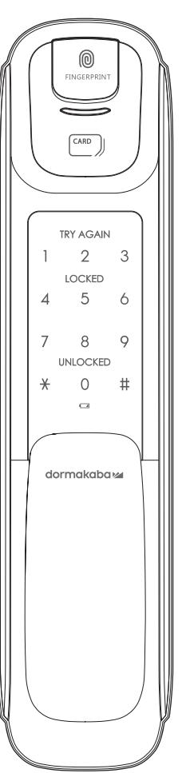

# **使用注意事項 產品保證書**

# **故障原因及解決方法 門鎖保固服務提醒**

# **產品規格**

- 請務必在使用前仔細閱讀使用說明書。
- 請定期更改密碼以確保使用安全。
- 若以逆向插入電池會造成漏液或破裂,請特別注意。
- 電池漏液時請立即更換所有電池。
- 請勿將新電池與正在使用中或使用完的電池混合使用。
- 請勿擅自安裝/拆卸/維修產品。
- 清潔時請用超纖細乾布擦拭,如需消毒也請將消毒酒精噴在乾淨的擦拭布上。 請勿使用錐子或針等尖銳物品按下按鈕或插在鑰匙孔裡。
- 本產品不得用於除智慧電子鎖以外的任何其他用途。
- 請勿以水、苯、酒精等任何溶劑直接噴灑於本產品,可能導致電路損壞 、產品劣化、漆面剝落。
- 請勿過度施壓於產品。
- 請務必保存產品保證書以享受維修服務。

## 請務必委託安裝工程師負責安裝工作。 若因客戶擅自安裝而造成的產品故障,維修費用可能由客戶自行承擔。

| 故障現象                        | 解決方法                                                                                   |
|-----------------------------|----------------------------------------------------------------------------------------|
| 無法接通電源                      | 請確認電池的插入狀態或漏液狀態。 請確認電池的插入方向及極性標記。 請更換所有電池。                                       |
| 密碼無法註冊成功                    | 打開電池蓋按下【註冊】鍵後,參考本使用說明書 所載之"密碼註冊方法",請再試一次。                                           |
| 輸入密碼後按下【#】鍵無法開門             | 請確認您輸入的密碼與註冊的密碼是否一致。 在輸入密碼的過程中,若數字鍵盤燈熄滅則無法正常 輸入,此時請用手掌觸碰鍵盤,在鍵盤燈亮起的狀態下 重新輸入密碼。 |
| 用密碼/感應卡可對註冊訊息進行確認, 但無法開門 | 請使用緊急電源(9V)。 可能因門鎖故障所致,請聯繫客服中心。                                                     |
| 運行時發出"滴滴滴"的警報聲              | 這是提示更換電池的警報聲,此時請更換所有電池。                                                                |
| 無法自動鎖閉                      | 請重新設置為自動鎖閉模式。 當電池漏液時,只會出現操作音而不會運行,請更換 所有電池。                                      |

| 鹼性電池 (另行購買) 溫度傳感器 (實驗室環境) (現實環境) 外側鎖體 鋁、鋅、ABS 塑料 內側鎖體 鋅、ABS 塑料 | 開鎖方式                 | 指紋 密碼 感應卡 | 100 最多註冊 枚 位數 (最多可註冊4個) 最多可註冊 100個 |
|-------------------------------------------------------------------------------------|----------------------|-----------------|------------------------------------------------|
| 材質                                                                                  | 額定電壓 應急電源 高溫感應 |                 | 鹼性電池                                           |
|                                                                                     |                      |                 |                                                |

**用管理員密碼驗證 : 用管理員感應卡驗證 :**

按下【註冊】鍵 輸入管理員密碼 按下【#】鍵

按下【註冊】鍵 用管理員感應卡接觸

進入註冊模式 輸入【1】鍵

|                      | 後按下【#】鍵                  |                                                   |
|----------------------|--------------------------|---------------------------------------------------|
| 用戶密碼不能與管理員 / 訪客密碼相同。 |                          | 在數字鍵盤指示燈熄滅之前,重複進行上述第3項操作,即可新增註冊其他用戶密碼。(最多可註冊4個)   |
| 註冊指定地址的用戶密碼          |                          |                                                   |
| 進入註冊模式後 輸入【1】鍵    | 進入所要註冊地址(1~4) 後按下【#】鍵 | 輸入用戶密碼(4-12位數字) 後按下【#】鍵                        |
|                      |                          |                                                   |
| 用戶密碼不能與管理員 / 訪客密碼相同。 |                          | 在數字鍵盤指示燈熄滅之前,重複進行上述第2-3項操作,即可新增註冊其他用戶密碼。(最多可註冊4個) |
| 註冊訪客密碼 * 一次性         |                          |                                                   |
| 進入註冊模式               | 輸入【4】鍵                   | 輸入用戶密碼(4-12位數字) 後按下【#】鍵                        |
|                      |                          |                                                   |

輸入用戶密碼(4-12位數字)

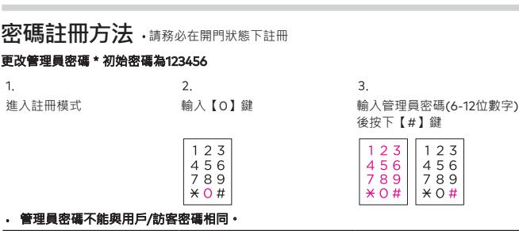

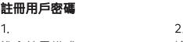

- 未在10秒內輸入,驗證將被取消。
- 若輸入小於6位或13位及以上的數字密碼,將發出錯誤提示音,驗證將被取消。
- 輸入管理員密碼的過程中,若按下【\*】鍵,其輸入過程將被初始化。
- 若在未輸入密碼的狀態下按【#】鍵或在驗證過程中按【註冊】鍵,驗證將被取消。

# **進入註冊模式**

訪客密碼不能與管理員 / 用戶密碼相同。 用訪客密碼開門成功後,相關訪客密碼將被刪除。

- 若未在10秒內輸入,驗證將被取消。
- 輸入管理員/用戶/訪客密碼的過程中,若按下【\*】鍵,其輸入過程將被初始化。

若未在輸入密碼的狀態下按下【#】鍵或在驗證過程中按【註冊】鍵,驗證將被取消。

| ﮧ U H |  |  |
|-------|--|--|
|       |  |  |
|       |  |  |
|       |  |  |
|       |  |  |

- **型號**
- **序號**

**購買(安裝)日期**

**安裝服務商名稱**

**安裝工程師姓名**

**電話號碼**

**地址**

- **申請保修時,請務必出示記載著購買日期的本保證書,方能享受相應的保固服務。**
- **對於本產品的品質保證,以本說明書所載之內容為準給予保修服務。**
- **產品保修期自購買之日起計算,請務必在保證書上記載購買日期。**
- **為提升產品性能,本公司保留。**

感謝閣下選用 為保證您的權益,請注意以下保固條款。 智慧電子鎖,本公司為您鎖購買的 門鎖產品提供保固服務。

- 凡在我司授權銷售管道購買的門鎖產品,自購買日起在選型及正確使用情況下,免費保固 2 年。
- 如果您在非我司授權的銷售商處購買到標稱 品牌的門鎖產品,均屬於假冒偽劣 產品,我司均不提供保固服務。
- 購買產品時,請您務必向銷售商索取發票,並妥善保管。
- 門鎖安裝後請注意提醒安裝工程師填寫說明書上的"產品保證書"訊息,銷售商將根據"產品 保證書"資訊註冊產品。保固時,須提供產品保證書和發票。
- 您購買的產品需要維修服務時,請第一時間聯繫銷售商或致電本司服務熱線,由我司授權單位 提供維修服務。
- 其他不屬於保固範圍的情況 :

相關保固條款細節請查閱我司官方網站,或致電本公司服務熱線0800-666-838諮詢。

### 超出保固期的產品 ;

- 產品保證書上的產品型號、機身條碼與實物不相符的產品 ;
- 擅自塗改產品保證書或機身條碼的產品 ;
- 由非我司授權服務單位安裝出現安裝問題的產品 ;
- 自行拆卸、改裝造成損壞的產品 ; 因不可抗力(地震、火災、水災等)造成損壞的產品。
- 

| (最多可註冊10個) 管理員感應卡不能與用戶卡片相同。 |                                         | 在數字鍵盤指示燈熄滅之前,重複進行上述第3項操作,即可新增註冊其它管理員卡片。 |
|--------------------------------|-----------------------------------------|-----------------------------------------|
| 註冊指定地址的管理員卡片                   |                                         |                                         |
|                                |                                         |                                         |
| 進入註冊模式後 輸入【0】鍵              | 進入所要註冊的地址 (1~10)後按下【#】鍵              | 用管理員卡片接觸                                |
|                                |                                         |                                         |
| (最多可註冊10個) 管理員卡片不能與用戶卡片相同。  | 在數字鍵盤指示燈熄滅之前,反覆進行第2-3項操作,即可添加註冊其它管理員卡片。 |                                         |
| 註冊用戶卡片                         |                                         |                                         |
|                                |                                         |                                         |
| 進入註冊模式                         | 輸入【2】鍵                                  | 用用戶卡片接觸                                 |
|                                |                                         |                                         |

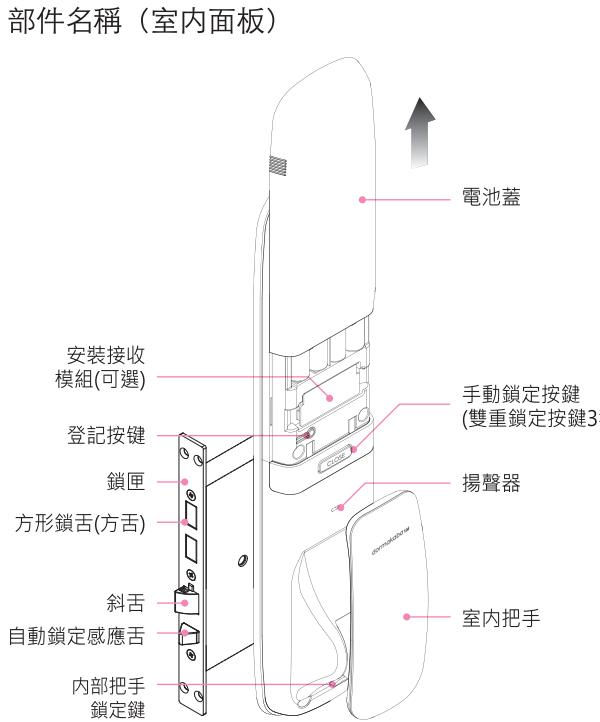

在數字鍵盤指示燈熄滅之前,反覆進行第3項操作,即可添加註冊其它管理員卡片。

(最多可註冊100位)

**用戶卡片不能與管理員卡片相同。**

**若未在**10**秒內輸入,驗證將被取消。**

**若未在輸入密碼的狀態下按下【**#**】鍵或在註冊過程中按【註冊】鍵,驗證將被取消。**

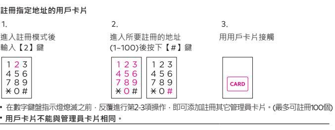

NCC警語 「取得審驗證明之低功率射頻器材,非經核准,公司、商號或使用者均不得擅自變更頻率、加大 功率或變更原設計之特性及功能。低功率射頻器材之使用不得影響飛航安全及干擾合法通信; 經發現有干擾現象時,應立即停用,並改善至無干擾時方得繼續使用。 前述合法通信,指依電信管理法規定作業之無線電通信。低功率射頻器材須忍受合法通信或工業、 科學及醫療用電波輻射性電機設備之干擾。」

## **注意!**

PTMP5441ONTA REV.02

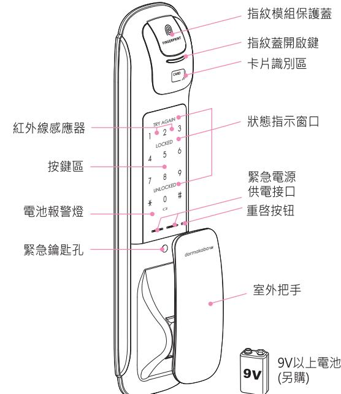

將執手往下拉開門,內部反鎖功能鍵被解除。

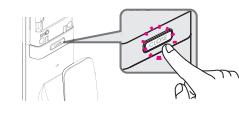

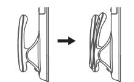

自動上鎖

啟用

#### **防惡作劇警報**

#### **高溫感應警報**

## **入侵警報**

#### **緊急電池的使用方法**

## **提示更換電池**

**提示方舌卡住**

若連續5次輸入尚未註冊的密碼,或連續次將尚未註冊的卡片接觸到卡片感應區,即會發出 警報聲,此後1分鐘無法進行驗證。

1分鐘後,輸入已註冊的密碼或將已註冊的感應卡接觸到感應卡感應區,將使產品恢復正常使用。

取出電池或輸入密碼,或將卡片接觸到卡片感應區即可解除警報聲。

在門被鎖上的狀態下,若感應到門被異常開啟會發出80分貝以上的警報聲2分鐘。

- 發出警報聲後,若仍未更換電池而繼續使用,很快就會不能使用,雇請務必即時更換電池。
- 更換電池時,請更換所有電池。
- 請勿將新電池與在使用中或使用完的電池混合使用。

請勿將製造商互不相同的電池混合使用。

在正常運行後,到了需要更換電池之時,產品會發出"滴滴滴"的警報聲。

為安全起見,若感應到疑似火災的異常高溫 即會發出強烈警報聲並自動解除鎖定 狀態。

因電池漏液而無法開門時,請購買市場銷售的應急電池 做為緊急電源。

**在室內解除內部反鎖** 在門被鎖上的狀態下長按【反鎖】鍵3秒鐘。

若警報聲響不停且產品仍不正常運行,需要重新調整門鎖位置,此時請聯繫本公司的安裝工程師。

將緊急電池 接觸到應急的電源接口。

開/關門時,當內側鎖體的方舌不正常運行而被卡住時,即會連續發出3次的"滴滴滴"的警報聲。

輸入管理員/用戶密碼後按下 鍵。

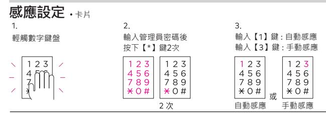

- 內側鎖體長時間暴露在直射陽光下也會發出警報聲。
- 即使在內部反鎖模式下也會自動解除鎖定狀態。

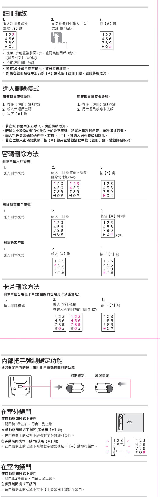

產品本身溫度高時警報聲將不會解除。

(在雙重驗證模式下)用管理員 / 用戶卡片感應認證。

**上鎖設定**

**虛位密碼功能設定**

# **提示及警報功能**

| 開門報警設定 | 提示門未上鎖的功能          |                            |
|--------|--------------------|----------------------------|
|        |                    |                            |
| 輕觸數字鍵盤 | 輸入管理員密碼後 按下【*】鍵 | 輸入【2】鍵 : 設定 輸入【0】鍵 : 解除 |
|        |                    |                            |
|        |                    | 設定                         |

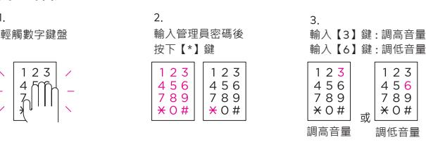

| 進入刪除模式                                        | 按【3】鍵                                                | 再按【*】鍵確認              |
|-----------------------------------------------|------------------------------------------------------|-----------------------|
|                                               |                                                      |                       |
|                                               |                                                      |                       |
| 在室外開門·密碼 常規方式開門                            |                                                      |                       |
|                                               |                                                      |                       |
| 輕觸鍵盤                                          | 輸入管理員/用戶/訪客密碼                                        | 按【#】鍵                 |
|                                               |                                                      |                       |
|                                               | 如果在第2步之前輸入【*】鍵,則門將靜音打開。                              |                       |
| 雙重認證下開門                                       |                                                      |                       |
| 輕觸鍵盤                                          | 輸入管理員/用戶/訪客密碼                                        | 按【#】鍵讀取卡片或用戶指紋        |
|                                               |                                                      | 或                     |
|                                               | 訪客密碼不可用於雙重認證。(即使在雙重身份驗證設置的情況下也進行一般驗證)                |                       |
|                                               | 卡片如未註冊,則雙重驗證不適用。(即使在雙重驗證設置的情況下也進行一般驗證)               |                       |
| 若10秒內沒有任何輸入,則認證被取消。                           | 如果您對暴露密碼有疑慮,請使用虛位密碼功能。(但如輸入超過21位數字,包括密碼會產生           |                       |
| 一個錯誤音,您將不得不再次輸入。)                             | 如果輸入密碼超過5次,警報會響起並持續1分鐘。1分鐘後,當未經授權的狀態解除時,請            |                       |
| 再試一次。                                         |                                                      |                       |
| 用訪客密碼打開門時,改訪客密碼即被刪除。                          | 設定虛位密碼功能,在密碼前後輸入虛數(隨機數),門將打開。                        |                       |
|                                               |                                                      |                       |
| 在室外開門                                         | 卡片                                                   |                       |
| 將卡片接觸到感應區即可開門。 在雙重驗證模式下,請先輸入密碼。            | 在卡片手動驗證模式下,請先輕觸數字鍵盤後,再將卡片接觸到感應區。                     |                       |
|                                               |                                                      |                       |
|                                               | 當用註冊過的指紋按上指紋感應器上時,門鎖就會被打開。                           |                       |
|                                               |                                                      |                       |
|                                               |                                                      |                       |
|                                               |                                                      |                       |
|                                               |                                                      |                       |
|                                               | 將緊急鑰匙孔蓋往左推即可打開緊急鑰匙孔。                                 |                       |
|                                               | 將緊急鑰匙插入緊急鑰匙孔後,向左 / 右旋轉即可開門。                          |                       |
|                                               |                                                      |                       |
|                                               | 在門上鎖的情況下,將外側鎖體的把手推或拉,門就會打開。 推拉把手在7秒內不開門的話,就會自動上鎖。 |                       |
|                                               |                                                      |                       |
|                                               |                                                      |                       |
|                                               |                                                      |                       |
|                                               |                                                      | 聯鎖器 / 遙控器 / 接受器均需另行購買 |
| 註冊聯鎖器 / 遙控器                                   |                                                      |                       |
| 進入註冊模式                                        | 鍵                                                    | 鍵                     |
|                                               |                                                      |                       |
|                                               | 聯鎖器 遙控器                                           |                       |
| (最多可註冊置5個)                                    | 若在上述第3項操作前重複進行第2項操作,即可新增註冊其他聯鎖器 / 遙控器。               |                       |
| 刪除連鎖器 / 遙控器                                   |                                                      |                       |
| 指紋用戶 在室外開門 緊急鑰匙 聯鎖器 / 遙控器功能設置 進入刪除模式 | 輸入【5】鍵                                               | 按下【*】鍵                |
|                                               |                                                      |                       |
|                                               |                                                      |                       |

### **在內部反鎖 禁止室外開門 設置內部反鎖**

**自動 / 手動上鎖設定**

**設置在手動上鎖模式下【#】鍵的停用/啟用**

| 輕觸數字鍵盤 | 輸入管理員密碼後 按下【*】鍵 | 輸入【5】鍵 : 設置 輸入【8】鍵 : 解除 |
|--------|--------------------|----------------------------|
|        |                    | 設置                         |

雙重認證功能在出廠時預設為解除狀態。

自動感應功能在出廠時預設為開啟狀態。

在手動感應模式下,請先輕觸數字鍵盤後,再將卡片接觸到卡片感應區即可開門。

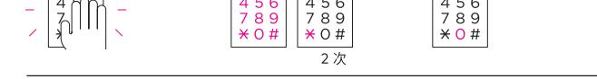

| 刪除單個管理員感應卡(感應卡)        |                              |           |
|------------------------|------------------------------|-----------|
|                        |                              |           |
| 進入刪除模式                 | 輸入【0】鍵                       | 用管理員感應卡接觸 |
|                        |                              |           |
|                        |                              |           |
|                        |                              |           |
| 刪除所有管理員感應卡             |                              |           |
|                        |                              |           |
| 進入刪除模式                 | 輸入【0】鍵                       | 按住【#】鍵3秒  |
|                        |                              |           |
|                        |                              |           |
|                        |                              |           |
| 刪除單個用戶感應卡(要刪除的用戶卡預設地址) |                              |           |
|                        |                              |           |
| 進入刪除模式                 | 輸入【2】鍵後 再輸入鎖要刪除的地址(1-100) | 按下【*】鍵    |
|                        |                              |           |
|                        |                              |           |
|                        |                              |           |
| 刪除單個用戶感應卡(感應卡)         |                              |           |
|                        |                              |           |
| 進入刪除模式                 | 輸入【2】鍵                       | 接觸用戶感應卡   |
|                        |                              |           |
|                        |                              |           |
| 刪除所有用戶感應卡              |                              |           |
| 刪除所有用戶感應卡              |                              |           |
|                        |                              |           |
| 進入刪除模式                 | 輸入【2】鍵                       | 按住【#】鍵3秒  |
|                        |                              |           |
|                        |                              |           |
|                        |                              |           |
|                        |                              |           |
|                        |                              |           |
|                        |                              |           |

輕觸數字鍵盤

輕觸數字鍵盤

輕觸數字鍵盤

虛位密碼功能在出廠時預設為開啟狀態。

自動上鎖功能在出廠時預設為開啟狀態。 最初設置手動上鎖時,【#】鍵處於停用狀態。 設置自動上鎖模式時,關門後2秒左右,門會自動鎖上。 再手動上鎖模式下,即使關門,門也不會自動鎖上。

輸入管理員密碼後 按下【\*】鍵2次

輸入管理員密碼後 按下【\*】鍵2次

輸入管理員密碼後 按下【\*】鍵2次

輸入【4】鍵 : 自動上鎖 輸入【7】鍵 : 手動上鎖

輸入【8】鍵 : 停用【#】鍵 輸入【9】鍵 : 啟用【#】鍵

輸入【0】鍵 : 設定 / 解除

手動上鎖

#### 音量可分為7個階段

開門警報功能在出廠時預設為解除狀態。

開門警報功能啟用時,門未鎖上會發出警報聲1分鐘,LED指示燈將同時閃爍。