## dormakaba »

# 使用説明書

## DP830/DP850

指紋/卡片/密碼/緊急鑰匙 (DP850)

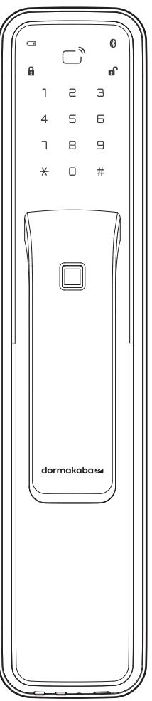

## 使用注意事項

- 請務必在使用前仔細閱讀使用說明書
- · 請定期更改密碼以確保使用安全。
- ·若以逆向插入電池會造成漏液或破裂·請特別注意。
- · 電池漏液時請立即更換所有電池。
- · 請勿將新電池與正在使用中或使用完的電池混合使用。
- · 請勿擅自安裝/拆卸/維修產品。
- · 清潔時請用超細纖維乾布擦拭。
- · 請勿使用錐子或針等尖銳物品按下按紐或插在鑰匙孔裡。
- ·本產品不得用於除智慧電子鎖以外的任何其他用途。
- 請注意避免有水滲入產品
- · 請勿禍度施壓於產品。
- 請務必保存產品保證書以享有維修服務。

#### 請務必委託安裝工程師負責安裝工作。 若因客戶擅自安裝而造成的產品故障,維修費用可能由客戶自行承擔。

## 故障原因及解決方法

| 故障現象                        | 解決方法                                                                                  |
|-----------------------------|---------------------------------------------------------------------------------------|
| 無法接通電源                      | 請確認電池的插入狀態或漏液狀態 請確認電池的插入方向及極性標記 請更換所有電池。                                        |
| 密碼無法註冊成功                    | 打開電池蓋按下【註冊】鍵後,參考本使用說明書 所載之"密碼註冊方法",請再試一次。                                          |
| 輸入密碼後按下【#】鍵無法開門             | 請確認您輸入的密碼與註冊的密碼是否一致。 在輸入密碼的過程中,若數字鍵盤燈熄滅則無法正常 輸入·比時請用手掌觸碰鍵盤·在鍵盤燈亮起的狀態 重新輸入密碼。 |
| 用密碼/卡片可對註冊訊息進行確認 · 但無法開門 | 請使用緊急外接電源(9V)。 可能因門鎖故障所致,請聯繫客服中心。                                                  |
| 運行時發出"滴滴滴"的警報聲              | 這是提示更換電池的警報聲·此時請更換所有電池。                                                               |
| 無法自動上鎖                      | 請重新設置為自動上鎖模式 當電池漏液時,只會出現操作音而不會運行,請更換 所有電池。                                      |

### 產品規格

| 額定電壓                        | 密碼 투서 DC 6V | 4-12 位數 (最多可註冊4個) 最多可註冊 100個 LR6 1.5V AA 鹼性電池 |  |
|-----------------------------|-------------------|-----------------------------------------------------|--|
| 緊急電源                        | DC 9V             | 鹼性電池(另行購買)                                          |  |
| 高溫威應 溫度傳咸器 材質 外側鎖體 |                   | 72℃ ±5℃ (寶驗室環境), 62℃ ±5℃ (現寶環境) 铝、锌、ABS塑胶        |  |
|                             | 内側鎖體              | 锌、ABS 塑料                                            |  |

產品保證書

| 型號                                                                                                    |
|-------------------------------------------------------------------------------------------------------|
| 序號                                                                                                    |
| 購買(安裝)日期                                                                                              |
| 安裝服務商名稱                                                                                               |
| 安裝工程師姓名                                                                                               |
| 電話號碼                                                                                                  |
| 地址                                                                                                    |
| At 17 1/2 1/2 1/2 1/2 1/2 1/2 1/2 1/2 1/2 1/2 1/2 1/2 1/2 1/2 1/2 1/2 1/2 1/2 1/2 1/2 1/2 1/2 1/2 1/2 |

- 申請保修時,請務必出示記載著購買日期的本保證書,方能享受相應
- 對於本產品的品質保證,以本說明書所載之內容為準給予保修服務 • 產品保修期自購買之日起計算,請務必在保證書上記載購買日期。
- 為提升產品性能,本公司保留對產品功能及外觀設計隨時更改之權利

#### dormakaba 門鎖保固服務提醒

感謝閣下選用dormakaba 智慧電子鎖‧本公司為您鎖購買的 dormakaba門鎖產品提供保固服務 為保證您的權益,請注意以下保固條款。

- 1. 凡在我司授權銷售管道購買的門鎖產品‧自購買日起在選型及正確使用情況下‧免費保固 2年。
- 2. 如果您在非我司授權的銷售商處購買到標稱"dormakaba"品牌的門鎖產品,均屬於假冒偽劣 產品,我司均不提供保固服務。
- 3. 購買產品時,請您務必向銷售商索取發票,並妥善保管。
- 4. 門鎖安裝後請注意提醒安裝工程師填寫說明書上的"產品保證書" 訊息‧銷售商將根據"產品 保證書" 資訊註冊產品。保固時‧須提供產品保證書和發票
- 5. 您購買的產品需要維修服務時‧請第一時間聯繫銷售商或致電本司服務熱線‧由我司授權單位 提供維修服務。
- 6. 其他不屬於保固範圍的情況
- 超出保固期的產品
- · 產品保證書上的產品型號·機身條碼與實物不相符的產品 ;
- 擅自塗改產品保證書或機身條碼的產品 ;
- · 由非我司授權服務單位安裝出現安裝問題的產品; · 自行拆卸、改裝造成損壞的產品;
- 因不可抗力(地震·火災·水災等)造成損壞的產品

相關保固條款細節請查閱我司官方網站‧或致電本公司服務熱線0800-666-838諮詢 -

#### 注意!

依據 低功率電波輻射性電機管理辦法

第十二條

經型式認證合格之低功率射頻電機,非經許可·公司、商號或使用者均不得擅自變更頻率 加大功率或變更原設計之特性及功能。

第十四條

卡片註冊方法

(最多可註冊10個)

· 管理者卡片不能與使用者卡片相同· 註冊指定位址的管理者卡片

註冊管理者卡片

進入註冊模式

1

低功率射頻電機之使用不得影響飛航安全及干擾合法通信;經發現有干擾現象時,應立即停用 並改善至無干擾時方得繼續使用。前項合法通信·指依電信法規定作業之無線電通信 低功率射頻電機須忍受合法通信或工業、科學及醫療用電波輻射性電機設備之干擾。

• 請務必在開門狀態下註冊

• 在數字鍵盤指示燈熄滅之前·重複進行上述第3項操作·即可新增註冊其它管理者卡片

進入所要註冊的位址

(1~10)後按下【#】鍵

\* 0 # × 0 #

1 2 3

4 5 6

7 8 9

輸入【O】鍵 123 4 5 6 ) 8 9 9
1 × 0 × 0 × 0 × 4 × 0 × 4 × 0 × 4 × 0 × 4 × 0 × 4 × 0 × 4 × × 0 × × 0 × × × × × × × × × × × × × × × × × × × × × × × × × × × × × × × × × × × × × × × × × × × × × × × ×

フ

2.

2.

123 4 5 6
7 8 9

#### 各單元名稱

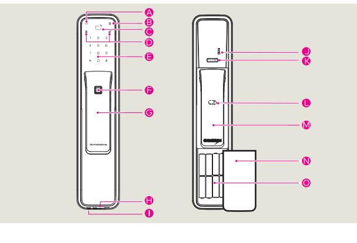

| タイ (創業費         | 內側鎖體 |          |
|-----------------|------|----------|
| 公 低電量指示燈        |      | 0 [註冊]鍵  |
| 3 卡片感應區         |      | 【反鎖】鍵    |
| ● 藍牙指示燈         |      | 1 內側把手鎖定 |
| ● 狀態指示燈         |      | M 内側把手   |
| 司 键股            |      | N 電池蓋    |
| ■ 指紋辨識區 (DP850) |      | ● 電池     |
|                 |      |          |

## 進入註冊模式

| 用管理者密碼驗證:  | 用管理者卡片驗證:   |
|------------|-------------|
| . 按下【註冊】鍵  | 1. 按下【註冊】鍵  |
| 2. 輸入管理者密碼 | 2. 用管理者卡片接觸 |
| 3 按下【#】鍵   |             |

· 未在10秒內輸入·驗證將被取消。

- 若輸入小於6位或13位及以上的數字密碼·將發出錯誤提示音,驗證將被取消
- 輸入管理者密碼的過程中·若按下【\*】鍵·其輸入過程將被初始化。
- · 若在未輸入密碼的狀態下按【#】鍵或在驗證過程中按【註冊】鍵·驗證將被取消。

密碼註冊方法 請務必在開

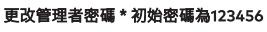

1.

1.

進入註冊模式

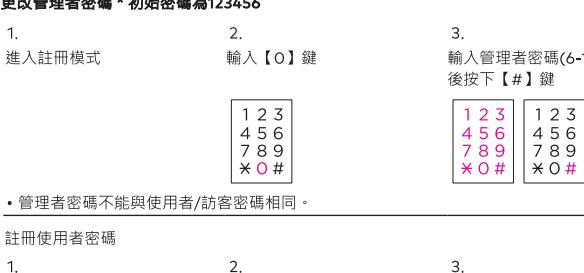

輸入【1】鍵

1 2 3

4 5 6

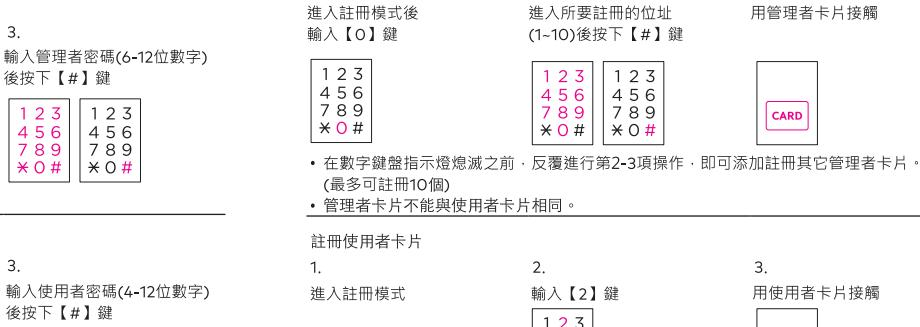

1.

3. 輸入【2】鍵 用使用者卡片接觸 Card

.

3

3.

用管理者卡片接觸

用管理者卡片接觸

| 門狀態下註冊             |                                                                  |
|--------------------|------------------------------------------------------------------|
| 【○】 键              | 3. 輸入管理者密碼(6-12位 後按下【#】鍵                                   |
| 23 રે દિ 3 9 | 1 2 3   1 2 3 4 5 6     7 8 9      7 8 9      4 5 6 789 |

G 外側把手 4 [復位]按鍵 1 緊急電源接口

組成部件 組成部件會根據安裝環境有所變更

- 使用説明書 · 鎖體 • 安裝說明書 ・ 方舌/方型鎖頭 • 施工圖 ・ 鎖扣板 ・ 螺桿
- · 電池
- · 卡片
- 遙控器(另行購買)

| 水 O | / ಕಿ ி |    |
|--------|--------------|----|
|        | #            | メイ |

10 # | x 0 # | x 0 # | x 0 # | | x 0 # | | x 0 # | | x 0 # | | x 0 # | | x 0 # | | x 0 # | | x 0 # | | | x 0 # | | | x 0 # | | | x 0 # | | | x 0 # | | | x 0 # | | | x | # |

後按下【#】鍵

123

123

· 在數字鍵盤指示燈熄滅之前·重複進行上述第3項操作·即可新增註冊其他使用者密碼。(最多可註冊4個) • 使用者密碼不能與管理者 / 訪客密碼相同 <

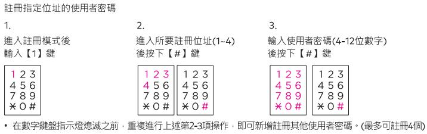

· 使用者密碼不能與管理者/訪客密碼相同。

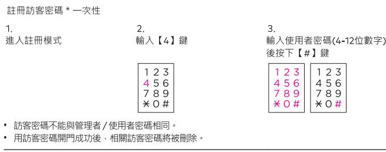

- 若未在10秒內輸入·驗證將被取消。
- 輸入管理者/使用者/訪客密碼的過程中·若按下【\*】鍵·其輸入過程將被初始化。
- 若未在輸入密碼的狀態下按下【#】鍵或在驗證過程中按【註冊】鍵·驗證將被取消

| × 0 # |  |  |
|-------|--|--|
|       |  |  |

- 在數字鍵盤指示燈熄滅之前·反覆進行第3項操作·即可添加註冊其它管理者卡片 (最多可註冊100位)
- · 使用者卡片不能與管理者卡片相同。

| 註冊指定位址的使用者卡片                   |                                                                      |                                                      |
|--------------------------------|----------------------------------------------------------------------|------------------------------------------------------|
| 1.                             | 2.                                                                   | ന്                                                   |
| 進入註冊模式後 輸入【2】鍵              | 進入所要註冊的位址 (1~100)後按下【#】鍵                                          | 用使用者卡片接觸                                             |
| 123 4 5 6 7 8 9 * 0 # | 1 2 3   1 2 3 4 5 6     4 5 6 789 7 8 9 * 0 #   * 0 # | CARD                                                 |
| · 使用者卡片不能與管理者卡片相同。             |                                                                      | · 在數字鍵盤指示燈熄滅之前·反覆進行第2-3項操作·即可添加註冊其它管理者卡片。(最多可註冊100個) |

·若未在10秒內輸入,驗證將被取消。

• 若未在輸入密碼的狀態下按下【#】鍵或在註冊過程中按【註冊】鍵,驗證將被取消。

藍牙設備註冊方法

1. 下載應用程序(dormakaba smartlock)

2. 開啟應用程式後輸入【+】按紐 3.輸入資訊並輸入【開始綁定】按鈕 4. 確認門所LED閃爍後,按【註冊】 • 最多可以註冊10部智慧手機

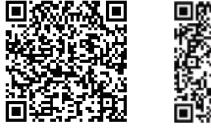

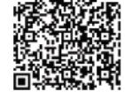

IOS版本

Android版本

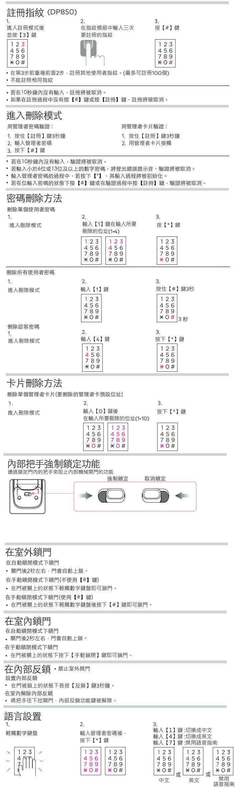

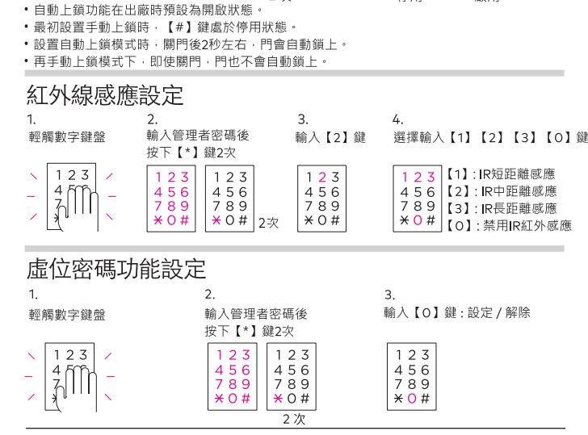

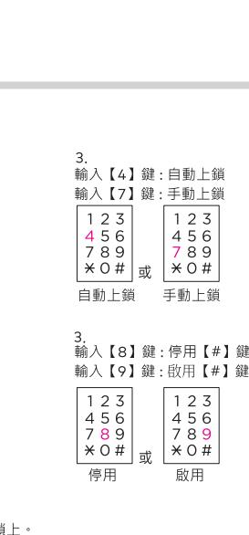

| x U #                                                                                                                                                                        | 在 1.         |
|------------------------------------------------------------------------------------------------------------------------------------------------------------------------------|-----------------|
| ന 按住【#】鍵3秒                                                                                                                                                                | 2.              |
| 4 15 6 6 7 1 8 8 8 8 17 88 8 8 秒 1 × 0 1 4 1 8 秒 秒 秒 秒 秒 秒 秒 秒 秒 秒 秒 秒 秒 秒 秒 秒 秒 秒 秒 秒 秒 秒 秒 秒 秒 秒 秒 秒 秒 秒 秒 秒 秒 秒 秒 秒 秒 秒 秒 秒 秒 秒 秒 秒 秒 秒 秒 秒 秒 秒 秒 秒 秒 秒 秒 秒 秒 秒 秒 秒 秒 秒 秒 | 在 。 在 · 抄 |
|                                                                                                                                                                              |                 |
|                                                                                                                                                                              |                 |

| · 如果在第2步之前輸入【*】鍵·則門將靜音打開。 雙重認證下開門 1. 彰體鍵盤 | 5 4 6 8 7 9 × O H 2.                                                                                                    | 5 4 6 7 9 8 × 0 # 3. 輸入管理者/使用者/訪客密碼 按【#】鍵請取卡片或使用者指紋 |
|----------------------------------------------------|-------------------------------------------------------------------------------------------------------------------------------------------------|-----------------------------------------------------------------------------|
| 23                                                 | 2 3 - 5 4 6 8 7 9 O # * · 訪客密碼不可用於雙重認證。(即使在雙重身份驗證設置的情況下也進行一般驗證) · 卡片如未註冊·則雙重驗證不適用。(即使在雙重驗證設置的情況下也進行一般驗證) | 23 1 5 6 র্ব 7 8 9 CARD * 0 # ak (DP850          |
| ·若10秒內沒有任何輸入·則認證被取消。 個錯誤音,您將不得不再次輸入。) 再試一次。  | · 如果輸入密碼超過5次·營報會響起並持續1分鐘。1分鐘後·當末經授權的狀態解除時,請                                                                                                     | 。如果您對暴露密碼有疑慮・請使用虛位密碼功能。(但如輸入超過21位數字・包括密碼會產生                                 |

3.

再按【\*】鍵確認

4 5 6

789

× 0 #

·用訪客密碼打開門時·改訪客密碼即被删除

• 設定虚位密碼功能‧在密碼前後輸入虛數(隨機數)‧門將打開

#### 在室外開門・卡片

將卡片接觸到感應區即可開門

刪除所有指紋 (DP850)

按【3】鎖

4 5 6
7 8 9

\* 0 #

密碼

進入刪除模式

在室外開門

常規方式開門

· 在雙重驗證模式下·請先輸入密碼。 • 在卡片手動驗證模式下·請先輕觸數字鍵盤後·再將卡片接觸到感應區 指紋使用者 (DP850) 當用註冊過的指紋按上指紋感應器上時‧門鎖就會被打開 « 藍牙使用者 1, 打開手機上的dormakaba電子鎖應用程式‧並靠近門鎖 2. 左邊按鍵:開鎖 / 右邊按鍵:開鎖 / 或手機搖一搖開鎖。

### 王室外開門・緊急論影

將緊急鑰匙孔蓋往左推即可打開緊急鑰匙孔

將緊急鑰匙插入緊急鑰匙孔後,向左 / 右旋轉即可開門

#### E室内開門

在門上鎖的情況下,將外側鎖體的把手推或拉,門就會打開

锥拉把手在7秒內不開門的話‧就會自動上鎖

| 遙控器功能設置    | · 遙控器需另行購買                                                                                                                                                                    |                                          |
|------------|-------------------------------------------------------------------------------------------------------------------------------------------------------------------------------|------------------------------------------|
| 註冊遙控器      |                                                                                                                                                                               |                                          |
| 1.         | 2.                                                                                                                                                                            | 3.                                       |
| 進入註冊模式     | 按下【OPEN】鍵                                                                                                                                                                     | 按下【#】键                                   |
|            | ದ 搖控器                                                                                                                                                                      | 1 2 3 5 6 র্ব 8 9 7 * 0 # |
| (最多可註冊置5個) | · 若在上述第3項操作前重複進行第2項操作,即可新增註冊其他遙控器。                                                                                                                                            |                                          |
| 删除遙控器      |                                                                                                                                                                               |                                          |
| 1.         | 2                                                                                                                                                                             | ന                                        |
| 進入刪除模式     | 翰入【5】鍵                                                                                                                                                                        | 按下【*】键                                   |
|            | 1 2 3 4 5 6 7 8 9 * 0 #                                                                                                                                           | 123 4 5 ୧ 7 8 9 × 0 #     |
|            | · · · · · · · · · · · · · · · · · · · · · · · · · · · · · · · · · · · · · · · · · · · · · · · · · · · · · · · · · · · · · · · · · · · · · · · · · · · · · · · · · · · · · · · |                                          |

## 提示及警報功能

提示方舌卡住

開/開門時,當內側鎖體的方舌不正常運行而被卡住時,即會連續發出3次的",滴滴滴"的警報聲 若警報聲響不停目產品仍不正常運行,需要重新調整門鎖位置,此時請聯繫本公司的安裝工程師。

#### 提示更換電池

在正常運行後,到了需要更換電池之時,產品會發出"滴滴滴"的警報聲。

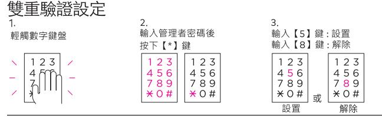

中文

自動感應

手動感應

英文

• 雙重認證功能在出廠時預設為解除狀態

| 啟用藍牙設備 1. 郵錯鍵盤 1 2 3 l / ব | 2. 輸入管理者密碼 並按【*】鍵2次 231 1 2 3 5 6 4 5 6 4 7 8 9 7 8 9 * O #   * 0 # 2 次 | ന 按 【5】鍵:啟用藍牙 ਸਿੱ 【6】鍵:不啟用藍牙 1 2 3 1 2 3 4 5 6   4 5 6 7 8 9   7 8 9 * 0 # * 0 # ग्री 不啟用藍牙 啟用藍牙 |
|-------------------------------------------|----------------------------------------------------------------------------------------------------------------|-----------------------------------------------------------------------------------------------------------------------------------------------|
| 感應設定・κห 1. 輕觸數字鍵盤                   | 2. 輸入管理者密碼後 按下 (*) 鍵2次                                                                                   | ന 輸入【1】鍵:自動感應 輸入【3】鍵:手動感應                                                                                                               |
| 123 / 1                             | 23 1 2 3 5 6 4 5 6 4 7 8 9 7 8 9 × ○ #     * 0 #                                 | 23 1 2 3 5 €   5 ୧ ব ব 7 8 9 7 8 9 * 0 # * 0 # ी                                                          |

·自動感應功能在出廠時預設為開啟狀態。

· 在手動感應模式下·請先輕觸數字鍵盤後·再將卡片接觸到卡片感應區即可開門

2次

虛位密碼功能在出廠時預設為開啟狀態

刪除單個管理者卡片(卡片)

進入刪除模式

删除所有管理者卡片

進入刪除模式

進入刪除模式

進入刪除模式

删除所有使用者卡片

刪除藍牙設備

進入刪除模式並按【7】鍵

進入刪除模式

從手機中刪除

1.

123

4 5 6

789

× 0 #

1.

1. 啟動應用程序

刪除單個藍牙設備

刪除整個藍牙設備

進入刪除模式

上鎖設定 自動 / 手動上鎖設定

輕觸數字鍵盤

輕觸數字鍵盤

1 2 3

1 2 3

設置在手動上鎖模式下【#】鍵的停用/啟用

1.

刪除單個使用者卡片(卡片)

1

1.

1.

2

輸入【0】鍵

123

4 5 6
7 8 9

\* 0 #

輸入【0】鍵

123

4 5 6
7 8 9

× 0 #

輸入【2】鍵後

4 5 6

輸入【2】鍵

123

4 5 6
7 8 9

\* 0 #

輸入【2】鍵

123

4 5 6
7 8 9

\*0 #

2. 輸入你想要註冊的手機號碼

輪入你想要註冊的手機號碼

789 | 789
¥0 #

再輸入鎖要刪除的位址(1-100)

つ

2

2.

2.

2.

2

2

輸入管理者密碼後

1 2 3 1 1 2 3
4 5 6 4 4 5 6 4 4 5 6 4 4 5 6 4 4 5 6 4 4 5 6 3 4 1 2 3 4 1 2 3 1 1 2 3 1 1 2 3 1 1 2 3 1 1 2 3 1 1 2 3 1 1 2 3 1 1 2 3 1 1 2 3 1 1 2 3 1 1 2 3 1 1 2 3 1 1 2 3

\*0# \*0#

輸入管理者密碼後

按下【\*】鍵2次

123

89 ×0# 2次

123

4 5 6
7 8 9

¥ 0 #

按下【\*】鍵2次

• 輸入智慧手機號碼時,您必須輸入國家/地區代碼 <

4 5 6

7 8 9

× 0 #

按【7】鍵

123

4 5 6 7 8 9

\* 0 #

删除單個使用者卡片(要刪除的使用者卡預設位址)

ನ

ಗ

3.

按住【#】鍵3秒

×0 # 3 秒

按下【\*】鍵

1 2 3

4 5 6
7 8 9

\* 0 #

CARD

接觸使用者卡片

按住【#】鍵3秒

3. 刪除綁定

123

4 5 6

789 ×0 # 3 秒

3.

3.

3.

按【\*】鍵

1 2 3

4 5 6

789

\*0#

123

4 5 6
7 8 9

用管理者卡片接觸

| 1. 輕觸數字鍵盤         | 2. 輸入管理者密碼後 按下【*】键                                                     | 3. 輸入【3】鍵:調高音量 輸入【6】鍵:調低音量                                                               |
|----------------------|------------------------------------------------------------------------------|------------------------------------------------------------------------------------------------|
| 1 2 3 / য 7 | 23   1 2 3 5 6 4 5 6 য 8 9 7 7 8 9 * 0 # * 0 # | 1 2 3 1 2 3 4 5 6 4 5 6   8 ਰ 7 7 8 9 × 0 # * 0 # 或 調高音量 調低音量 |

·音量可分為7個階段

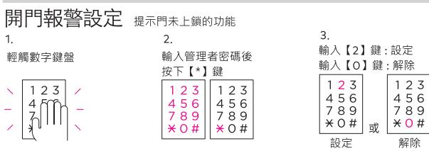

• 開門警報功能在出廠時預設為解除狀態。

· 開門警報功能啟用時·門未鎖上會發出警報聲1分鐘·LED指示燈將同時閃爍

- 發出警報聲後,若仍未更換電池而繼續使用·很快就會不能使用,雇請務必即時更換電池
- 更換電池時,請更換所有電池。
- 請勿將新電池與在使用中或使用完的電池混合使用
- 請勿將製造商互不相同的電池混合使用。

#### 緊急電池的使用方法

- 1. 將緊急電池 (9V) 接觸到應急的電源接口
- 2. 輸入管理者/使用者密碼後按下[#] 鍵
- 3. (在雙重驗證模式下)用管理者 / 使用者卡片威應認證
- 因電池漏液而無法開門時,請購買市場銷售的應急電池 (9V) 做為緊急電源

#### 入侵警報

在門被鎖上的狀態下,若感應到門被異常開啟會發出80分貝以上的警報聲2分鐘

取出電池或輸入密碼,或將卡片接觸到卡片感應區即可解除警報聲。

#### 高溫感應警報

為安全起見,若感應到疑似火災的異常高溫(62°C±5°C),即會發出強烈警報聲並自動解除鎖定 狀態。

- 內側鎖體長時間暴露在直射陽光下也會發出警報聲。
- 即使在內部反鎖模式下也會自動解除鎖定狀態。

· 產品本身溫度高時警報聲將不會解除。

#### 防惡作劇警報

123

0 09 0
1 7 0 0 0
1 1 1 1

解除

若連續5次輸入尚未註冊的密碼·或連續次將尚未註冊的卡片接觸到卡片威應區·即會發出 警報聲,此後1分鐘無法進行驗證。

• 1分鐘後·輸入已註冊的密碼或將已註冊的卡片接觸到卡片威應區·將使產品恢復正常使用