## **FA9000**

# **使用說明書**

**人臉/卡片/指紋/密碼/機械鑰匙**

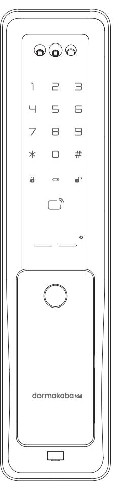

## **使用注意事項 產品保證書**

### **故障原因及解決方法 門鎖保固服務提醒**

### **產品規格**

- 請務必在使用前仔細閱讀使用說明書。
- 請定期更改密碼以確保使用安全。
- 若以逆向插入電池會造成漏液或破裂,請特別注意。
- 電池漏液時請立即更換所有電池。
- 請勿將新電池與正在使用中或使用完的電池混合使用。
- 請勿擅自安裝/拆卸/維修產品。
- 清潔時請用超纖細乾布擦拭,如需消毒也請將消毒酒精噴在乾淨的擦拭布上。
- 請勿使用錐子或針等尖銳物品按下按鈕或插在鑰匙孔裡。
- 本產品不得用於除智慧電子鎖以外的任何其他用途。
- 請勿以水、苯、酒精等任何溶劑直接噴灑於本產品,可能導致電路損壞 、產品劣化、漆面剝落。
- 請勿過度施壓於產品。
- 請務必保存產品保證書以享受維修服務。

## 請務必委託安裝工程師負責安裝工作。

若因客戶擅自安裝而造成的產品故障,維修費用需由客戶自行承擔。

| 故障現象                        | 解決方法                                                                                   |
|-----------------------------|----------------------------------------------------------------------------------------|
| 無法接通電源                      | 請確認電池的插入狀態或漏液狀態。 請確認電池的插入方向及極性標記。 請更換所有電池。                                       |
| 密碼無法註冊成功                    | 打開電池蓋按下【註冊】鍵後,參考本使用說明書 所載之密碼註冊方法,請再試一次。                                             |
| 輸入密碼後按下【#】鍵無法開門             | 請確認您輸入的密碼與註冊的密碼是否一致。 在輸入密碼的過程中,若數字鍵盤燈熄滅則無法正常 輸入,此時請用手掌觸碰鍵盤,在鍵盤燈亮起的狀態下 重新輸入密碼。 |
| 用密碼/感應卡可對註冊訊息進行確認, 但無法開門 | 請使用緊急電源(9V)。 可能因門鎖故障所致,請聯繫客服中心。                                                     |
| 運行時發出 "滴滴滴" 的警報聲            | 這是提示更換電池的警報聲,此時請更換所有電池。                                                                |
| 無法自動鎖閉                      | 請重新設置為自動鎖閉模式。 當電池漏液時,只會出現操作音而不會運行,請更換 所有電池。                                      |

|              | 指紋 密碼 卡片 | 最多註冊100組 位數 (最多可註冊4個) 最多可註冊 100張 |
|--------------|----------------|----------------------------------------|
| 額定電壓 緊急電源 |                | 鹼性電池 鹼性電池 (另行購買)                    |
| 高溫感應         | 溫度傳感器          | (實驗室環境) (現實環境)                      |
| 材質           | 外側鎖體           | 鋁、鋅、ABS 塑料                             |
|              | 內側鎖體           | 鋅、ABS 塑料                               |
|              |                |                                        |

**用管理者密碼驗證 : 用管理者卡片驗證 :**

按下【註冊】鍵

按下【註冊】鍵

#### 進入註冊模式後 進入所要註冊位址(1~4) 輸入使用者密碼(4-12位數字)

輸入管理者密碼 按下【#】鍵 感應管理者卡片 未在10秒內輸入,驗證將被取消。 若輸入錯誤的密碼,將發出錯誤提示音,驗證將被取消。 輸入管理者密碼的過程中,若按下【\*】鍵,其輸入過程將被初始化。 若在未輸入密碼的狀態下按【#】鍵或在驗證過程中按【註冊】鍵,驗證將被取消。

請務必在開門狀態下註冊 進入註冊模式 進入註冊模式 在數字鍵盤指示燈熄滅之前,重複進行上述第3項操作,即可新增註冊其他使用者密碼。(最多可註冊4個) 使用者密碼不能與管理者 / 訪客密碼相同。 輸入【0】鍵 輸入【1】鍵 輸入管理者密碼(6-12位數字) 後按下【#】鍵 輸入使用者密碼(4-12位數字) 後按下【#】鍵 **更改管理者密碼 \* 初始密碼為123456 註冊使用者密碼 管理者密碼不能與使用者密碼/訪客密碼相同。 註冊指定位址的使用者密碼 密碼註冊方法**

**進入註冊模式**

**型號 序號 購買(安裝)日期 安裝服務商名稱 安裝工程師姓名 電話號碼**

**地址**

- **申請保固及維修時,請務必出示記載著購買日期的本保證書,方能享受相應的保固服務。**
- **對於本產品的品質保證,以本說明書所載之內容為準給予保固及維修服務。**
- **產品保固及維修期自購買之日起計算,請務必在保證書上記載購買日期。 為提升產品性能,本公司保留對產品功能及外觀設計隨時更改之權利。**

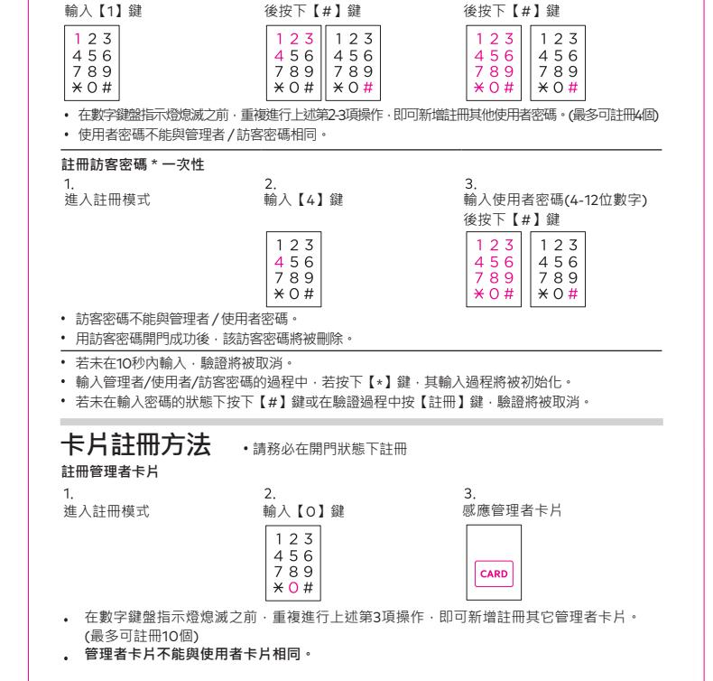

感謝閣下選用 為保證您的權益,請注意以下保固條款。 智慧電子鎖,本公司為您所購買的 門鎖產品提供保固服務。

其他不屬於保固範圍的情況 :

相關保固條款細節請查閱我司官方網站,或致電本公司服務熱線0800-666-838諮詢。

- 凡在我司授權銷售管道購買的門鎖產品,自購買日起在選型及正確使用情況下,免費保固 2 年。
- 如果您在非我司授權的銷售商處購買到標稱 品牌的門鎖產品,均屬於假冒偽劣 產品,我司均不提供保固服務。
- 購買產品時,請您務必向銷售商索取發票,並妥善保管。
- 門鎖安裝後請注意提醒安裝工程師填寫說明書上的 "產品保證書" 訊息,銷售商將根據產品 保證書資訊註冊產品。保固時,須提供產品保證書和發票。
- 您購買的產品需要維修服務時,請第一時間聯繫銷售商或致電本司服務熱線,由我司授權單位 提供維修服務。

超出保固期的產品。

- 產品保證書上的產品型號、機身條碼與實物不相符的產品。
- 擅自塗改產品保證書或機身條碼的產品。
- 由非我司授權服務單位安裝出現安裝問題的產品。
- 自行拆卸、改裝造成損壞的產品。
- 因不可抗力(地震、火災、水災等)造成損壞的產品。

可以註冊100個臉部識別ID

- 註冊新的臉部ID時,不會刪除現有的臉部ID
- 註冊期間請勿配戴口罩、帽子、太陽眼鏡或眼罩
- 確保直視鏡頭,不要眨眼或改變表情
- 可能會識別出同卵雙胞胎或外觀非常相似的人,導致門解鎖

| 註冊指定位址的管理者卡片                    |                                         |         |
|---------------------------------|-----------------------------------------|---------|
|                                 |                                         |         |
| 進入註冊模式後 輸入【0】鍵               | 進入所要註冊的位址 (1~10)後按下【#】鍵              | 感應管理者卡片 |
|                                 |                                         |         |
| (最多可註冊10個) 管理者卡片不能與使用者卡片相同。  | 在數字鍵盤指示燈熄滅之前,反覆進行第2-3項操作,即可添加註冊其它管理者卡片。 |         |
| 註冊使用者卡片                         |                                         |         |
|                                 |                                         |         |
| 進入註冊模式                          | 輸入【2】鍵                                  | 感應使用者卡片 |
|                                 |                                         |         |
| (最多可註冊100個) 使用者卡片不能與管理者卡片相同。 | 在數字鍵盤指示燈熄滅之前,反覆進行第3項操作,即可添加註冊其它使用者卡片。   |         |
| 註冊指定位址的使用者卡片                    |                                         |         |
|                                 |                                         |         |
| 進入註冊模式後                         | 進入所要註冊的位址                               | 感應使用者卡片 |
| 輸入【2】鍵                          | (1~100)後按下【#】鍵                          |         |
|                                 |                                         |         |

**若未在**10**秒內輸入,驗證將被取消。 若未在輸入密碼的狀態下按下【**#**】鍵或在註冊過程中按【註冊】鍵,驗證將被取消。 使用者卡片不能與管理者卡片相同。 可識別距離在45-100cm之間 可識別高度在130-200cm之間 \*高度可能因為鎖的安裝高度而有不同。 人臉辨識註冊方法**

**註冊臉部識別ID**

**註冊指定位址的臉部識別ID**

進入註冊模式, 輸入【6】鍵

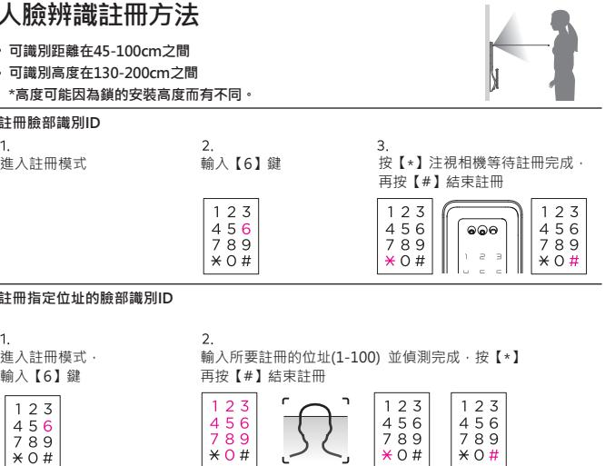

NCC警語 「取得審驗證明之低功率射頻器材,非經核准,公司、商號或使用者均不得擅自變更頻率、加大 功率或變更原設計之特性及功能。低功率射頻器材之使用不得影響飛航安全及干擾合法通信; 經發現有干擾現象時,應立即停用,並改善至無干擾時方得繼續使用。 前述合法通信,指依電信管理法規定作業之無線電通信。低功率射頻器材須忍受合法通信或工業、 科學及醫療用電波輻射性電機設備之干擾。」

### **注意!**

PTMP8800ONTA REV.01

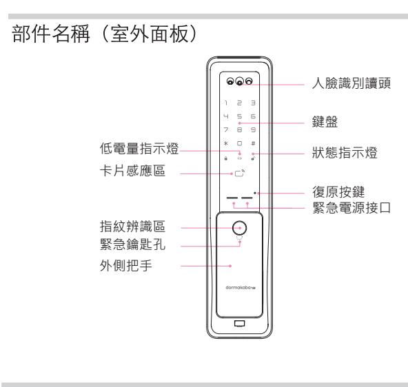

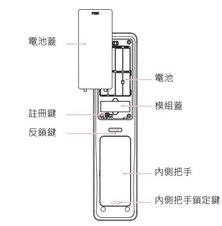

- **電池**
- **卡片**

**遙控器(另行購買)**

| 鎖體      | 使用說明書 |
|---------|-------|
|         |       |
| 方舌/方型鎖頭 | 安裝說明書 |
| 鎖扣板     | 施工圖   |
| 螺桿      |       |

### **組成部件會依據安裝環境有所改變**

### **在室內解除內部反鎖** 將執手往下拉開門,

內部反鎖功能鍵被解除。

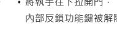

#### **防惡作劇警報**

#### **高溫感應警報**

#### **入侵警報**

### **緊急電池的使用方法**

### **提示更換電池**

### **提示方舌卡住**

若連續5次輸入尚未註冊的密碼,或連續次將尚未註冊的卡片接觸到卡片感應區,即會發出 警報聲,此後1分鐘無法進行驗證。

1分鐘後,輸入已註冊的密碼或將已註冊的感應卡接觸到感應卡感應區,將使產品恢復正常使用。

取出電池或輸入密碼,或將卡片接觸到卡片感應區即可解除警報聲。

在門被鎖上的狀態下,若感應到門被異常開啟會發出80分貝以上的警報聲2分鐘。

- 發出警報聲後,若仍未更換電池而繼續使用,很快就會不能使用,雇請務必即時更換電池。
- 更換電池時,請更換所有電池。
- 請勿將新電池與在使用中或使用完的電池混合使用。
- 請勿將製造商互不相同的電池混合使用。

為安全起見,若感應到疑似火災的異常高溫 即會發出強烈警報聲並自動解除鎖定狀態。

在正常運行後,到了需要更換電池之時,產品會發出 "滴滴滴"的警報聲。

因電池漏液而無法開門時,請購買市場銷售的緊急電池 做為緊急電源。

若警報聲響不停且產品仍不正常運行,需要重新調整門鎖位置,此時請聯繫本公司的安裝工程師。

將緊急電池 接觸到緊急的電源接口。

開/關門時,當內側鎖體的方舌不正常運行而被卡住時,即會連續發出3次的"滴滴滴"的警報聲。

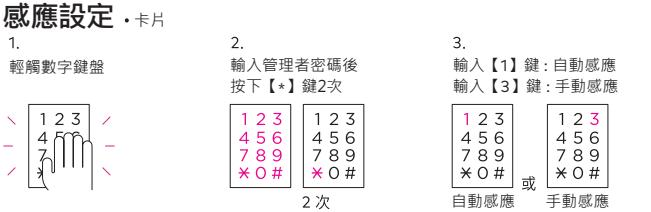

輸入管理者/使用者密碼後按下 鍵。

- 內側鎖體長時間暴露在直射陽光下也會發出警報聲。
- 即使在內部反鎖模式下也會自動解除鎖定狀態。
- 產品本身溫度高時警報聲將不會解除。

(在雙重驗證模式下)用管理者/ 使用者卡片感應認證。

## **虛位密碼功能設定**

### **提示及警報功能**

### **在室內鎖門**

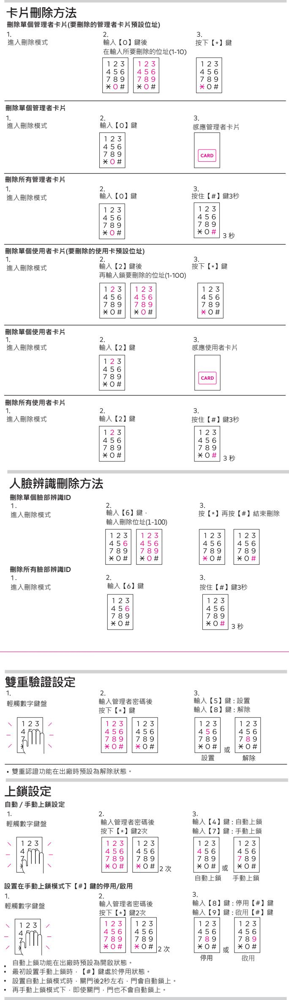

|           | 按下【*】鍵 | 輸入【6】鍵 : 調低音量 |
|-----------|--------|---------------|
|           |        |               |
|           |        | 調高音量 調低音量  |
| 音量可分為7個階段 |        |               |

#### **在內部反鎖 禁止室外開門**

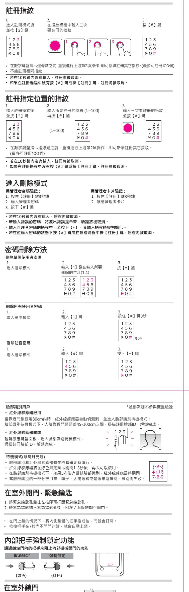

#### **在自動鎖閉模式下鎖門**

| 刪除單個指紋                                 |                                                                                                                                                                                      |                            |
|----------------------------------------|--------------------------------------------------------------------------------------------------------------------------------------------------------------------------------------|----------------------------|
| 進入刪除模式                                 | 輸入【3】鍵後 再輸入所要刪除的位置 (1~100)                                                                                                                                                     | 按下【*】鍵                     |
|                                        |                                                                                                                                                                                      |                            |
|                                        |                                                                                                                                                                                      |                            |
| 刪除所有指紋 進入刪除模式                       | 輸入【3】鍵                                                                                                                                                                               | 按住【#】鍵3秒                   |
|                                        |                                                                                                                                                                                      |                            |
| 在室外開門·密碼                               |                                                                                                                                                                                      |                            |
| 常規方式開門 輕觸鍵盤                         | 輸入管理者/使用者/訪客密碼                                                                                                                                                                       | 按【#】鍵                      |
|                                        |                                                                                                                                                                                      |                            |
|                                        |                                                                                                                                                                                      |                            |
|                                        | 如果在第2步之前輸入【*】鍵,則門將靜音打開。                                                                                                                                                              |                            |
| 雙重認證下開門 輕觸鍵盤                        | 輸入使用者密碼                                                                                                                                                                              | 按【#】鍵讀取卡片或使用者指紋            |
|                                        |                                                                                                                                                                                      |                            |
|                                        |                                                                                                                                                                                      | 或                          |
| 訪客密碼不可用於雙重認證。 卡片如未註冊,則雙重驗證不適用。      |                                                                                                                                                                                      |                            |
| 若10秒未輸入任何密碼,認證將被取消。 請再試一次。 在室外開門 | 如果您擔心密碼有暴露的疑慮,請使用虛位密碼功能。 (但若輸入超過21位數字,包括密碼會產生一個錯誤音,您將不得不再次輸入。) 如果輸入錯誤密碼超過5次,警報會響起並持續1分鐘。1分鐘後,當未經授權的狀態解除時, 用訪客密碼打開門時,該訪客密碼即被刪除。 設定虛位密碼功能,在密碼前後輸入虛數(隨機數),門將打開。 卡片 指紋 人臉 |                            |
| 將卡片接觸到感應區即可開門。 在雙重驗證模式下,請先輸入密碼。     | 在卡片手動驗證模式下,請先輕觸數字鍵盤後,再將卡片接觸到感應區。                                                                                                                                                     |                            |
| 指紋用戶                                   | 當用註冊過的指紋按上指紋感應器上時,門鎖就會被打開。                                                                                                                                                           |                            |
|                                        |                                                                                                                                                                                      |                            |
|                                        |                                                                                                                                                                                      |                            |
| 開門報警設定                                 | 提示門未上鎖的功能                                                                                                                                                                            |                            |
| 輕觸數字鍵盤                                 | 輸入管理者密碼後 按下【*】鍵                                                                                                                                                                   | 輸入【2】鍵 : 設定 輸入【0】鍵 : 解除 |
|                                        |                                                                                                                                                                                      |                            |
|                                        | 開門警報功能在出廠時預設為解除狀態。                                                                                                                                                                   | 設定                         |
|                                        | 開門警報功能啟用時,門未鎖上會發出警報聲1分鐘,LED指示燈將同時閃爍。 遙控器需另行購買                                                                                                                                     |                            |
| 遙控器功能設置 註冊遙控器                       |                                                                                                                                                                                      |                            |
| 進入註冊模式                                 | 鍵                                                                                                                                                                                    | 鍵                          |
|                                        |                                                                                                                                                                                      |                            |
|                                        | 遙控器 若在上述第3項操作前重複進行第2項操作,即可新增註冊其他遙控器。(最多可註冊置5個)                                                                                                                                    |                            |
| 刪除遙控器                                  |                                                                                                                                                                                      |                            |
| 進入刪除模式                                 | 輸入【5】鍵                                                                                                                                                                               | 按下【*】鍵                     |

#### **在手動鎖閉模式下鎖門**

**設置內部反鎖**

關門後2秒左右,門會自動上鎖。

在門被鎖上的狀態下長按【反鎖】鍵3秒鐘。

自動感應功能在出廠時預設為開啟狀態。

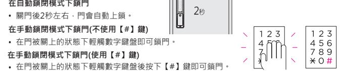

在手動感應模式下,請先輕觸數字鍵盤後,再將卡片接觸到卡片感應區即可開門。

在門被關上的狀態下按下【手動鎖閉】鍵即可鎖門。

虛位密碼功能在出廠時預設為開啟狀態。

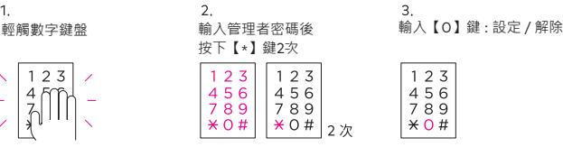

#### 1. 2. 3. 2 4. **紅外線感應設定** 輕觸數字鍵盤 輸入管理員密碼後 按下【\*】鍵2次 輸入【2】鍵 選擇輸入【1 】【2】【3】【0】鍵 【1 】: IR短距離感應 【2】: IR中距離感應 【3】: IR長距離感應 次 【0】: 禁用IR紅外感應