## dormakaba »

# 使用説明書

## MLED 指紋/卡片/密碼/緊急鑰匙

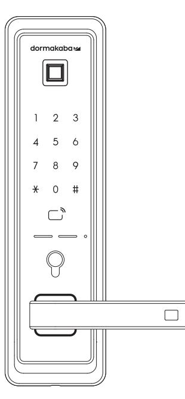

多瑪凱拔電子鎖產品使用者需負妥善保管管理者密碼及卡片之賣‧若因可歸賣於使用者之故意或過失遺失卡片 或遗忘管理者密碼時‧該電子鎖產品需進行重新設定‧使用者應自行承擔失去原有卡片及管理者密碼設定之風 險·自行承擔因遭失卡片或遺忘管理者密碼所造成之損失·dormakaba 及其經銷商或代理商均對前述情事不 負擔任何賠償或補償責任

## 各單元名稱

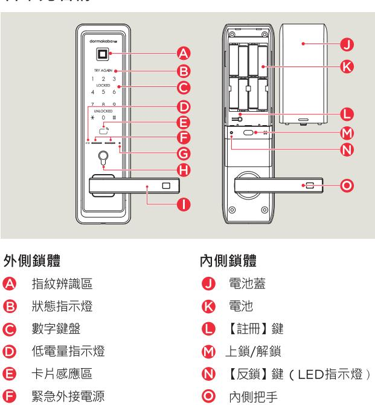

## 使用注意事項

- · 請務必在使用前仔細閱讀使用說明書。
- · 請定期更改密碼以確保使用安全。
- .若以逆向插入電池會造成漏液或破裂,請特別注意。
- · 電池漏液時請立即更換所有電池。
- ・ 請勿將新電池與正在使用中或使用完的電池混合使用。
- ・ 請勿擅自安裝 / 折卸 / 維修產品
- . 清潔時請用紹細纖維乾布擦拭。
- .請勿使用錐子或針等尖銳物品按下按紐或插在鑰匙孔裡。
- :本產品不得用於除智慧雷子鎖以外的任何其他用途。
- · 請注意避免有水滲入產品
- . 切勿禍度施壓於產品。
- · 請務必保存產品保證書以享受維修服務

## 請務必委託安裝工程師負責安裝工作。

若因客戶擅自安裝而造成的產品故障,維修費用可能由客戶自行承擔。

### 故障原因及解決方法

| PART PART PART PART PART PART PER PARTY PER PARTY PER PERSON PER PERSONAL PARTY PER PERSONAL PARTY PER PERSONAL PARTY PER PERSONAL PROPERTY PER PERSONAL PRODUCTION POST PERSO |                                                                                         |  |
|--------------------------------------------------------------------------------------------------------------------------------------------------------------------------------|-----------------------------------------------------------------------------------------|--|
| 故障現象                                                                                                                                                                           | 解决方法                                                                                    |  |
| 無法接通電源                                                                                                                                                                         | 請確認電池的插入狀態或漏液狀態。 請確認電池的插入方向及極性標記。 請更換所有電池。                                        |  |
| 容碼無法註冊成功                                                                                                                                                                       | 打開電池蓋並按下【註冊】鍵後、參考本使用說明書 所載之"密碼註冊方法",請再試一次。                                           |  |
| 輸入密碼後按下【#】鍵無法開門                                                                                                                                                                | 請確認您輸入的密碼與註冊時的密碼是否一致。 在輸入密碼的過程中·若數位鍵盤燈熄滅則無法正常 輸入,此時請用手掌觸碰鍵盤,在鍵盤燈亮起的狀態下 車新輸入密碼。 |  |
| 用密碼 / 卡片可對註冊資訊進行確認, 但無法開門                                                                                                                                                   | 請使用緊急外接電源(9V)。 可能因門鎖故障所致,請聯繫客服中心。                                                    |  |
| 使用時發出"滴滴滴"的警報聲                                                                                                                                                                 | 這是提示更換電池的警報聲,此時請更換所有電池。                                                                 |  |
| 無法自動上鎖                                                                                                                                                                         | 請重新設置為自動上鎖模式。 當電池漏液時‧只會出現操作音而不會運行‧請更換所 有電池。                                       |  |

## 注意事項

維護您的權益·請您詳讀注意事項。 保固期間內・本公司提供免費維修服務・但如遇下列情形者・ 本公司將酌收零件費及出勤維修費用 :

※ 擅自拆裝零件或修改,而導致不良情形。 ※ 未依使用説明書手冊規定操作損壞者 \* ※ 任意結合他牌產品而造成電子鎖產品故障時。 ※ 不可抗拒之天災地變,而造成的損壞。

## 進入註冊模式

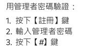

用管理者卡片驗證 1. 按下【註冊】鍵 2. 用管理者卡片接觸

若未在 10 秒内輸入・驗證將被取消

- 若輸入小於 6 位或 13 位數及以上的數位密碼·將發出錯誤提示音·驗證將被取消
- 輸入管理者密碼的過程中·若按下【\*】鍵·其輸入過程將被初始佔。
- 若在未輸入密碼的狀態下按【#】鍵或在驗證過程中按【註冊】鍵‧驗證將被取消

## 密碼註冊方法.請務必在開門狀態下註冊

更改管理者密碼 \*初始密碼為 123456

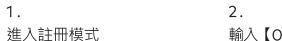

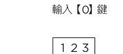

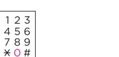

· 管理者密碼不能與使用者 / 訪客密碼相同

註冊使用者密碼 1 . つ 進入註冊模式 輸入【1】鍵 123 4 5 6

#### 產品保證書

| 序號 購買 ( 安裝 ) 日期 安裝服務商名稱 |  |
|-------------------------------|--|
| 安装工程師姓名                       |  |
| 電話號碼                          |  |
| 地址                            |  |

申請保固時‧請務必出示記載著購買日期的本保證書‧方能享受相應的保固服務

- · 對於本產品的品質保證·以本說明書所載之內容為准給予保固服務
- ・ 產品保固期自購買之日起計算・請務必在保證書上記載購買日期。

為提升產品性能·本公司保留對產品功能及外觀設計不經預先通知予以更改的權利

### dormakaba 門鎖保固服務提醒

感謝閣下選用 dormakaba智慧電子鎖·本公司為您所購買的 dormakaba門鎖產品提供保固服務 為保證您的權益,請注意以下保固條款:

凡在我司授權銷售管道購買的門鎖產品‧自購買日起在選型及正確使用情況下‧免費保固 2 年

- 2.如果您在非我司授權的銷售商處購買到標稱" dormakaba"品牌的門鎖產品‧均屬於假冒
- 產品,我司均不提供保固服務
- 3. 購買產品時‧請您務必向銷售商索取發票‧並妥善保管
- 4. 門鎖安裝後請注意提醒安裝工程師填寫說明書上的"產品保證書"資訊·銷售商將根據 "產品保證書"資訊進行產品資訊註冊。保固時,須提供產品保證書和發票。
- 5.您購買的產品需要維修服務時,請第一時間聯繫銷售商或致電本司,由我司授權單位提 供維修服務。
- 6. 其他不屬於保固範圍的情況 : ·超出保固期的產品;
	- 產品保證書上的產品型號丶機身條碼與實物不相符的產品;
	- 擅自塗改產品保證書或機身條碼序號的產品 ;
	- · 由非我司授權服務單位安裝出現安裝問題的產品;
	- 自行拆卸·改裝造成損壞的產品 ;
	- ·因不可抗力(地震、火災 ·水災等)造成損壞的產品。
- 相關保固條款細節請查閱我司官方網站、或致電本公司

#### 注意!

依據 低功率電波輻射性電機管理辦法

第十二條 經型式認證合格之低功率射頻電機‧非經許可‧公司、商號或使用者均不得擅自變更頻率

加大功率或變更原設計之特性及功能

第十四條

低功率射頻電機之使用不得影響飛航安全及干擾合法通信;經發現有干擾現象時,應立即停用 並改善至無干擾時方得繼續使用·前項合法通信·指依電信法規定作業之無線電通信 低功率射頻電機須忍受合法通信或工業、科學及醫療用電波輻射性電機設備之干擾。

| 註冊管理者卡片 1.                                                                  | 2.                                                                            | ന് 用管理者卡片威應 |
|--------------------------------------------------------------------------------|-------------------------------------------------------------------------------|----------------|
| 進入註冊模式                                                                         | 輸入【O】鍵 23 1 5 6 র্ব 7 8 9 × 0 #                             | CARD           |
| · 在數位鍵盤指示燈熄滅之前·重複進行上述第 3項操作,即可新增註冊其它管理者卡片。 (最多可註冊 10個) · 用戶卡片不能與管理者卡片相同。 |                                                                               |                |
| 註冊指定位址的管理者卡片                                                                   |                                                                               |                |
| 1. 進入註冊模式後 輸入【O】鍵                                                        | 2. 輸入所要註冊的位址 (1~10)後按下【#】鍵                                              | ന 用管理者卡片威應  |
| 123 5 6 ব 7 8 9 * 0 #                                           | 1 2 3 123 4 5 6 র্ব 5 6 7 7 8 9 8 9 * 0 # * 0 # | CARD           |
| (最多可註冊 10個) · 用戶卡片不能與管理者卡片相同。                                               | · 在數位鍵盤指示燈熄滅之前,重複進行第 2-3項操作,即可新增註冊其它管理者卡片。                                    |                |
| 註冊用戶卡片                                                                         |                                                                               |                |
|                                                                                |                                                                               |                |

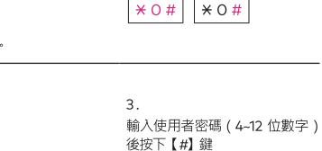

ನ

後按下【#】鍵

輸入管理者密碼 (6~12 位數字)

4 5 6

789

× 0 #

123

4 5 6

輸入使用者密碼 (4~12 位數字 )

123 4 5 6

789

× ○ #

G 【復位】錯 產品反應異常時‧可按此鍵重啟 (已被註冊的密碼和卡片不會被刪除) (H) 緊急鑰匙孔蓋、緊急鑰匙孔

. 外側把手

#### 組 成 西

· 銷體 · 方舌/方型鎖匣 · 螺絲包 · 雷光

## 産品規格

| 安装修件 | 普涌入戶門或室內門 | 門厚度為 40-75mm                   |  |
|------|-----------|--------------------------------|--|
| 開鎖方式 | 指紋        | 最多可註冊 100 組                    |  |
|      | 密碼        | 4-12 位數(最多可註冊4個)               |  |
|      | 卡片        | 最多可註冊 100 個                    |  |
| 額定電壓 | DC 6V     | LR6 1.5V AA 鹼性電池               |  |
| 緊急電源 | DC 9V     | 鹼性電池(另行購買)                     |  |
| 高温感應 | 溫度傳感器     | 72℃ ±5℃ (實驗室環境),62℃ ±5℃ (現實環境) |  |
| 材質   | 室外鎖體      | 鋸、鉄、ABS塑料                      |  |
|      | 室內鎖體      | 辞、ABS塑料                        |  |

• 使用說明書

· 安裝說明書

・ 施工園

· 卡片

|  | 1 O # 米 |  |
|--|------------------|--|
|--|------------------|--|

| 0 (# 米 | O # 米 |
|--------------|-------------|
|              |             |

1 2 3

3.

後按下【#】鍵

. 5 6

785

\* O #

. 在數位鍵盤指示燈熄滅之前 ‧重複進行上述第3項操作 ‧即可新增註冊其它使用者密碼。( 最多可註冊4個 ) .使用者密碼不能與管理者 / 訪客密碼相同。

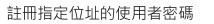

1.

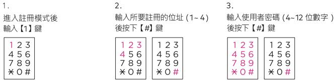

・ 在數位鍵盤指示燈熄滅之前・重複進行上述2-3項操作・即可新增計冊其它使用者密碼。(最多可訪冊4個) · 使用者密碼不能與管理者 / 訪客密碼相同。

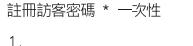

| 1.                      | 2.                                       |
|-------------------------|------------------------------------------|
| 進入註冊模式                  | 輸入【4】鍵                                   |
|                         | 1 2 3 ર્ટ દ ব 7 8 9 * 0 # |
| · 訪客密碼不能與管理者 / 使用者密碼相同。 |                                          |

 訪客密 用訪客密碼開門成功後‧相關訪客密碼將被刪除

若未在 10 秒內輸入・驗證將被取消

輸入管理者 / 使用者/ 訪客密碼的過程中·若按下【\*】鍵·其輸入過程將被初始化·

· 若未在輸入密碼的狀態下按下【#】鍵或在驗證過程中按【註冊】鍵·驗證將被取消。

| \* 0 # | -

用用戶卡片威應

card

在數位鍵盤指示燈熄滅之前 · 重複進行第 3 項操作 · 即可新增註冊其它用戶卡片 (最多可註冊 100 個)

輸入【2】鍵

用戶卡 片不能與管理者卡 片相同

進入註冊模式

| 進入許冊模式後 輸入【2】鍵       | 輸入所要許冊的位址 (1~100)後按下【#】鍵                     | 用用戶卡片感應 |
|-------------------------|-------------------------------------------------|---------|
| 23 1 4 5 6 789 | 123   123 4 5 6 1 4 5 6 7 8 9   789 | CARD    |

・ 用戶卡片不能與管理者卡片相同

若未在 10 秒內輸入·驗證將被取消。

若未在輸入密碼的狀態下按下【#】鍵或在註冊過程中按【註冊】鍵·驗證將被取消

## 藍牙設備註冊方法

1. 下載應用程式(dormakaba smartlock)

- 2. 開啟應用程式後輸入【+】按鈕
- 3.輸入資訊並輸入【開始綁定】按鈕
- 4 確認門所LED関蝉後・按【註冊】
- 最多可以許冊10部智慧手機 •

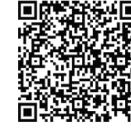

Android版本

IOS版本

注意:搭配中保無限家主機連線時・請使用中保無限家官方APP(中保無限+) c 建議勿共用以免發生錯誤。

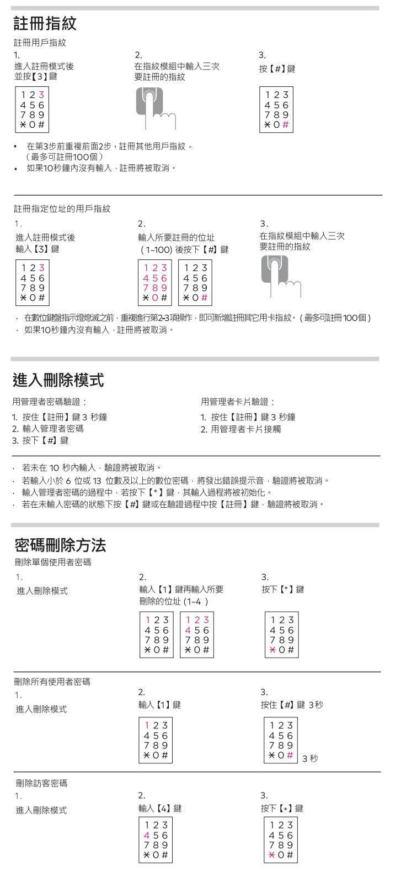

## 在室外開門·卡片 將卡片接觸到感應區即可開門 · 在卡片手動驗證模式下·請先輕觸數字鍵盤後·再將卡片接觸到威應區 · 部分卡片需先喚醒數字鍵盤後·才可感應使用。 指紋用户│當用註冊過的指紋按上指紋讀卡區塊上時‧鎖就會被打開 藍牙用户 | 1. 打開手機上的dormakaba電子鎖應用程式‧並靠近門鎖 │2. 左邊按鍵:關鎖/右邊按鍵:開鎖/或手機搖一搖開鎖。 在室外開門·緊急鑰匙 1. 將緊急鑰匙孔蓋往左推即可打開緊急鑰匙孔, 2. 將蔡志瑞起打造出生產品 9月份發展總結果。
2. 將緊急鑰匙插入緊急鑰匙孔後 · 向左/右旋轉即可開門 在室內開門 • 在門被鎖上的狀態下‧將把手往下拉即可開門 在室外鎖門 在自動上鎖模式下鎖門 · 關門後 2 秒左右 · 門會自動上鎖 在手動上鎖模式下鎖門(不使用【#】鍵 在門被關上的狀態下輕觸數位鍵盤即可鎖門 在手動上鎖模式下鎖門 ( 使用【#】鍵 ) 在門被關上的狀態下輕觸數位鍵盤後按下【#】鍵即可鎖門 在室內鎖門 在自動上鎖模式下鎖門 關門後 2 秒左右 · 門會自動上鎖

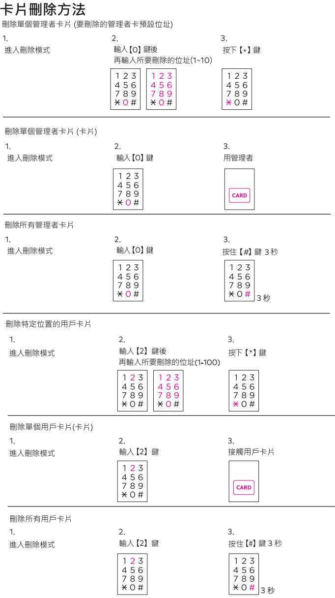

## 刪除藍牙設備

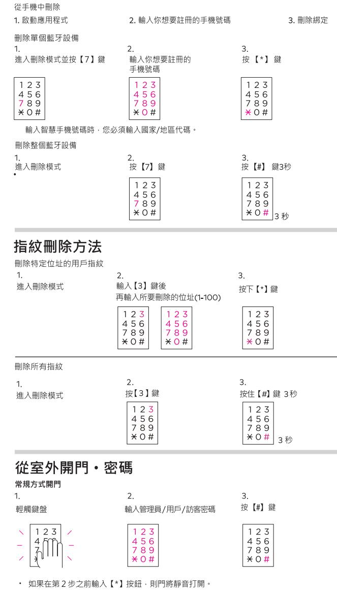

· 如果10秒內沒有任何輸入·則認證被取消。

有用の都有機能的出荷物 - Frantension - (但如輸入超過21位數字 - 包含密碼會產生
・ 如果您對暴露密碼感到焦慮 - 請使用虛位密碼功能 ・(但如輸入超過21位數字 ・包含密碼會產生
一個錯誤音 ・您將不得不再突輸入 ・ ) • 如果輸入的密碼超過5次 • 警報會響起並持續1分鐘 • 一分鐘後 • 當未經授權的狀態被釋放時

 請再試一次 用訪客密碼打開門時‧該訪客密碼即被刪除

- 設定虚位密碼功能‧在密碼前後輸入虛數 (隨機數)‧門將打開‧
- 開門警報設置 ·提示門未上鎖的功能 2. 3. 輕觸數位鍵盤 輸入管理者密碼後 輸入【2】鍵:設置 輸入【O】鍵:解除 按下【\*】鍵 123 123 4 5 6 4 5 6 4 5 6
7 8 9 Sun 0 #
1 x x 0 x # O # # O
T \* \* O # # T × 0 # \* O # \*0# 設置 解除 開門警報功能在出廠時預設設置為解除狀態 ・ 開門警報功能啟用時・門未鎖上會發出警報聲1分鐘・LED指示燈將同時閃爍 高溫警報設置 3. 2. 輕觸數位鍵盤 輸入管理者密碼後 輸入【2】鍵:開啟 / 關閉 按下【\*】鍵 2 次 123 123 123 4 5 6 4 5 6 4 5 6 )89
17 × 0 × 9
1 × 0 × 4 × 0 × 4 × 0 × 4 × 0 × 4 × 0 × 4 × 0 × 4 × 0 × 4 × 0 × 4 × 0 × 4 × 0 × 4 × 0 × 4 × 0 × 4 × 0 × 4 × 0 × 4 × 0 × 4 × 0 × 4 × 0 × 4 × 0 × 4 × 0 × 4 × 0 0 #
 \* O # \* 0 # 2 次

高溫警報功能出廠預設為關閉狀態

## 提示及警報功能

提示方舌卡住

開 / 關門時‧當室內鎖體的方丟不正常運行而被卡住時‧即會連續發出 3 次"嘀嘀嘀"的警報聲

若警報聲響不停目產品仍不正常運行‧需要重新調整門鎖位置‧此時請聯繫本公司的安裝工程師

在手動上鎖模式下鎖門 在門被關上的狀態下按下【手動上鎖】鍵即可鎖門

#### 在内部反鎖 ・禁止室外開

#### 設置內部反鎖

在門被鎖上的狀態下長按【反鎖】鍵 3 秒鐘。

#### 在室內解除內部反鎖

將把手往下拉開門·內部上鎖功能鍵被解除

| 啟用藍牙設備          |                                                                              |                                                                             |
|-----------------|------------------------------------------------------------------------------|-----------------------------------------------------------------------------|
| 1. 邮觸鍵盤      | 2. 輸入管理者密碼後 並按【*】鍵 2 次                                                 | ന 按【5】鍵:啟用藍牙 按【6】鍵:不啟用藍牙                                              |
| 1 2 3 ann    | 123 23 5 6     4 5 6 8 9   7 8 9 4 7 * 0 #   * 0 #            | 23 123 4 5 6 4 5 6 7 789 8 9 * 0 # * 0 # च्ये    |
|                 | 2 次                                                                          | 啟用藍牙 不啟用藍牙                                                               |
| 威應設置 . 卡片       |                                                                              |                                                                             |
| 1.              | 2.                                                                           | ന                                                                           |
| 輕觸數位鍵盤          | 輸入管理者密碼後 按下【*】鍵 2 次                                                       | 輸入【1】鍵:自動感應 輸入【3】鍵:手動威應                                                  |
| 1 2 3 / ব | 1 2 3 123 4 5 6 র্ব 5 6 7 8 9 7 8 9 * O #   * 0 # | 123 123 4 5 6 4 5 6 8 9 7 7 8 9 * 0 # * 0 # 司 |
|                 | 2-穴                                                                          | 自動感應 手動感應                                                                |

自動感應功能在出廠時預設設置為開啟狀態

在手動感應模式下‧請先輕觸數位鍵盤後‧再將卡片接觸到卡片感應區即可開門

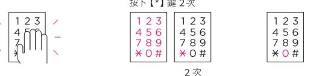

輸入管理者密碼後

#### .虛位密碼功能出廠預設為關閉狀態

虚位密碼功能設置

1.

輕觸數位鍵盤

上鎖設置

輕觸數位鍵盤

123

ുന്ന

輕觸數位鍵盤

設置在手動上鎖模式下【#】鍵的停用 / 啟用

自動上鎖功能在出廠時預設設置為開啟狀態

最初設置手動上鎖時 ·【#】鍵處於停用狀態

設置自動上鎖模式時・關門後 2 秒左右・門會自動鎖上

2

在手動上鎖模式下,即使關門後,門也不會自動鎖上

自動 / 手動上鎖設置

2

輸入管理者密碼後

按下【\*】鍵 2 次

123

4 8 8 9 9 #
1 7 % 0 #

2 次

4 5 6

789

\*0#

2 次

輸入管理者密碼後

按下【\*】鍵 2 次

\* O #

23

)の #
「 の #
」 の の #
「 ○ の #
「 ○ の #

4 5 6

3

1 2 3

156

1 2 3

4 5 6
17 8 9 9 9 9 9 9 9 9 9 9 9 8 9 9 8 9 9 8 9 8 9 8 9 8 9 8 8 9 8 8 8 8 8 8 8 8 8 8 8 8 8 8 8 8 8 8 8 8 8 8 8 8 8 8 8 8 8 8 8 8 8 8 8 8 8 8 8 8 8 8 8 8 8 8 8 8 8 8 8 8 8 8

停用

3.

¥0 # | 或

輸入【O】鍵:設置 / 解除

輸入【4】鍵:自動上鎖

輸入【7】鍵:手動上鎖

4 5 8 9
7 8 9
¥0 # 0 # 0 # 0 # 0 # 0 #

自動上鎖 手動上鎖

輸入【8】鍵:停用【#】鍵

輸入【9】鍵:啟用【#】鍵

1 2 3

4 5 6

7 8 9

× 0 #

啟用

1 2 3

4.5 6

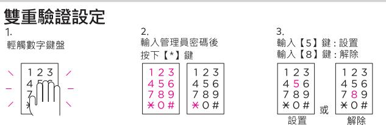

。雙重認證功能在出廠時預設為解除狀態。

。與中保無限家主機連線使用的版本將不提供本功能

| 音量設置                 |                                                                                   |                                                                            |
|----------------------|-----------------------------------------------------------------------------------|----------------------------------------------------------------------------|
| 1.                   | 2.                                                                                | 3.                                                                         |
| 輕觸數位鍵盤               | 輸入管理者密碼後                                                                          | 輸入【3】鍵:調高音量                                                                |
|                      | 按下【*】鍵                                                                            | 輸入【6】鍵:調低音量                                                                |
| 123 / ู่ใ / | 1 2 3   1 2 3 56   4 5 6 র্ব 8 9 7 7 8 9 * 0 #   * 0 # | 1 2 3   1 2 3 4 5 6   4 5 6 7 8 9 7 8 9 或│*○♯ : * 0 # |
|                      |                                                                                   | 調高音量 調低音量                                                               |

· 音量可分為 7 個階段。

#### 提示更換電池

#### 在正常運行後‧到了需要更換電池之時會‧產品會發出"嘀嘀嘀"的警報警

- 發出警報聲後‧若仍未更換電池而繼續使用‧很快就會停止運行‧故請務必及時更換電池
- 更換電池時,請更換所有電池。
- 請勿將新電池與在使用中或使用完的電池混合使用
- · 請勿將製造商互不相同的電池混合使用。

#### 緊急外接電池的使用方法

1. 將緊急外接電池(9V)接觸到緊急外接電源介面

2.輸入管理者/使用者密碼後按下 [#] 鍵‧或用管理者 / 用戶卡片感應認證

. 因電池漏液而無法開門時,請購買市場銷售的緊急外接電池(9V)作為緊急接電使用

#### 入侵警報

在門被鎖上的狀態下,若感應到門被異常開啟會發出 80分貝以上的警報聲

· 取出電池或輸入密碼·或將卡片接觸到卡片威應區即可解除警報聲

#### 高溫威應警報

在高溫警報功能開啟下‧若感應到疑似火災的異常高溫(62°C± 5°C)‧即會發出強烈警報聲並自動 解除鎖定狀態

- 內側鎖體長時間暴露在直射陽光下也會發出警報聲
- 即使在內部反鎖模式下也會自動解除鎖定狀態
- : 產品本身溫度高時警報聲將不會解除。

#### 防惡作劇警報

若連續5次執行下列動作:輸入未註冊的密碼/或感應未註冊的卡片/或威應未註冊的指紋‧即會 發出警報聲,此後1分鐘無法進行驗證。