# dormakaba »

# 使用説明書

# RL599

指紋/密碼/卡片/緊急鑰匙

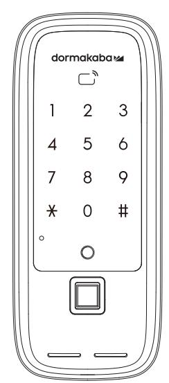

### 使用注意事項

- · 請務必在使用前仔細閱讀使用說明書。
- · 請定期更改密碼以確保使用安全。
- .若以逆向插入電池會造成漏液或破裂,請特別注意。
- ·電池漏液時請立即更換所有電池。
- · 請勿將新電池與正在使用中或使用完的電池混合使用。
- · 請勿擅自安裝 / 折卸 / 維修產品 <
- · 清潔時請用超細纖維乾布擦拭。
- ・ 請勿使用錐子或針等尖銳物品按下按紐或插在鑰匙孔裡。
- ·本產品不得用於除智慧電子鎖以外的任何其他用途。
- · 請注意避免有水滲入產品
- · 切勿過度施壓於產品。
- · 請務必保存產品保證書以享受維修服務。

### 請務必委託安裝工程師負責安裝工作。 若因客戶擅自安裝而造成的產品故障,維修費用可能由客戶自行承擔

### 故障原因及解決方法

| 故障現象                         | 解決方法                                                                                    |
|------------------------------|-----------------------------------------------------------------------------------------|
| 無法接通電源                       | 請確認電池的插入狀態或漏液狀態 請確認電池的插入方向及極性標記。 請更換所有電池。                                         |
| 密碼無法註冊成功                     | 打開電池蓋並按下【註冊】鍵後、參考本使用說明書 所載之"密碼註冊方法" ·請申請一次。                                       |
| 輸入密碼後按下【#】鍵無法開門              | 請確認您輸入的密碼與註冊時的密碼是否一致。 在輸入密碼的過程中,若數位鍵盤燈熄滅則無法正常 輸入,此時請用手掌觸碰鍵盤,在鍵盤燈亮起的狀態下 重新輸入密碼。 |
| 用密碼 / 卡片可對註冊資訊進行確認, 但無法開門 | 請使用緊急外接電源(9V)。 可能因門鎖故障所致,請聯繫客服中心。                                                    |
| 使用時發出"滴滴滴" 的警報聲           | 這是提示更換電池的警報聲·此時請更換所有電池。                                                                 |
| 無法自動上鎖                       | 請重新設置為自動上鎖模式。 當電池漏液時,只會出現操作音而不會運行,請更換所 有電池。                                       |

### 産品規格

| 額定會壓         | 卡片 指纹 DC 6V | 最多可註冊 100 個 100 網 LR6 1.5V AA 鹼性電池       |
|--------------|-------------------|------------------------------------------------|
| 緊急電源 高温威應 | DC 9V 溫度傳感器    | 鹼性電池(另行購買) 72℃ ±5℃ (實驗室環境) , 62℃ ±5℃ (現實環境) |
| 材質           | 室外鎖體 室內鎖體      | 铝、锌、ABS塑料 辞、ABS塑料                           |

### 各單元名稱

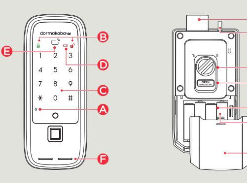

| 室外鎖體            |   | 室內鎖體       |
|-----------------|---|------------|
| △ 【復位】鍵         |   | ● 方舌(方形鎖頭) |
| 3  鎖定提示 LED 指示燈 |   | 日          |
| ● 數位鍵盤          |   | U 手動開闘旋紐   |
| () 低電量指示燈       | B | 【OPEN】鍵    |
| G 卡片威應區         |   | く【註冊】鍵     |

## 進入註冊模式

G

H

用管理者密碼驗證 用管理者卡片驗證 1. 按下【註冊】鍵 1 按下【註冊】鍵 2. 輸入管理者密碼 2. 用管理者卡片接觸 3. 按下【#】鍵

- 若未在 10 秒內輸入・驗證將被取消。
- 若輸入小於 6 位或 13 位數及以上的數位密碼·將發出錯誤提示音·驗證將被取消
- 輸入管理者密碼的過程中·若按下【\*】鍵·其輸入過程將被初始化·
- 若在未輸入密碼的狀態下按【#】鍵或在驗證過程中按【註冊】鍵·驗證將被取消
- 密碼註冊方法.請務必在開門狀態下註冊 更改管理者密碼 \*初始密碼為 123456

進入註冊模式

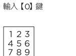

×0#

輸入【1】鍵

1 2 3

4 5 6
7 8 9

3

### · 管理者密碼不能與使用者 / 訪客密碼相同

註冊使用者密碼 1. 進入註冊模式

| 輸入管理者密碼(6~12 位數數            |                            |  |
|-----------------------------|----------------------------|--|
|                             | 位)後按下【#】鍵 123   123     |  |
| 5 6 বা 7 8 9 * 0 # | 4 5 6 7 8 ு × 0 # |  |
|                             |                            |  |

# 3 輸入使用者密碼(4~12 位數數

### 產品保證書

| 序號 購買 ( 安裝 ) 日期 |
|--------------------|
| 安裝服務商名稱            |
| 安装工程師姓名            |
| 電話號碼               |
| 地址                 |
|                    |

- 申請保固時‧請務必出示記載著購買日期的本保證書‧方能享受相應的保固服務
- ・ 對於本產品的品質保證‧以本說明書所載之內容為准給予保固服務
- · 產品保固期自購買之日起計算·請務必在保證書上記載購買日期。
- ・ 為提升產品性能·本公司保留對產品功能及外觀設計不經預先通知予以更改的權利《

### dormakaba 門鎖保固服務提醒

感謝閣下選用 dormakaba智慧電子鎖‧本公司為您所購買的 dormakaba門鎖產品提供保固服務 為保證您的權益·請注意以下保固條款:

- 1. 凡在我司授權銷售管道購買的門鎖產品‧自購買日起在選型及正確使用情況下‧免費保固2年‧
- 2.如果您在非我司授權的銷售商處購買到標稱" dormakaba"品牌的門鎖產品,均屬於假冒 產品・我司均不提供保固服務
- 3. 購買產品時‧請您務必向銷售商索取發票‧並妥善保管
- 4.門鎖安裝後請注意提醒安裝工程師填寫說明書上的"產品保證書"資訊‧銷售商將根據 "產品保證書"資訊進行產品資訊註冊。保固時,須提供產品保證書和發票。
- 5. 您購買的產品需要維修服務時 ·請第一時間聯繫銷售商或致電本司 · 由我司授權單位提 供維修服務
- 6. 其他不屬於保固範圍的情況
- ·超出保固期的產品:
- 產品保證書上的產品型號丶機身條碼與實物不相符的產品;
- 擅自塗改產品保證書或機身條碼序號的產品 ;
- ·由非我司授權服務單位安裝出現安裝問題的產品;
- ·自行拆卸·改裝造成損壞的產品;
- ・因不可抗力(地震、火災 ・水災等)造成損壞的產品
- 相關保固條款細節請查閱我司官方網站、或致電本公司
- 24小時服務熱線 : 0800-666838

### 注意!

依據 低功率電波輻射性電機管理辦法

第十二條 經型式認證合格之低功率射頻電機‧非經許可‧公司‧商號或使用者均不得擅自變更頻率 加大功率或變更原設計之特性及功能。

低功率射頻電機之使用不得影響飛航安全及干擾合法通信;經發現有干擾現象時,應立即停用 並改善至無干擾時方得繼續使用,前項合法通信,指依電信法規定作業之無線電通信 低功率射頻電機須忍受合法通信或工業、科學及醫療用電波輻射性電機設備之干擾

#### 卡片註冊方法 ·請務必在開門狀態下註冊 註冊管理者卡片 1. 2 用管理者卡片感應 進入註冊模式 輸入【O】鍵 123 4 5 6 CARD \*0# ,在數位鍵盤指示燈熄滅之前·重複進行上述第 3項操作·即可新增註冊其它管理者卡片 ( 最多可註冊 10 個 ) · 用戶卡片不能與管理者卡片相同 註冊指定位址的管理者卡片 2. 進人註冊模式後 輸入所要註冊的位址 用管理者卡片感應 輸入【O】鍵 (1~10) 後按下【#】鎖 123 4 5 6
17 00
17 7 8 9 ×0# \* 0 # × 0 # 在數位鍵盤指示燈熄滅之前‧重複進行第 2-3 項操作‧即可新增註冊其它管理者卡片 (最多可註冊 10 個 ) 用戶卡片不能與管理者卡片相同 註冊用戶卡片 3. 1. 2 輸入【2】鍵 進入註冊模式 用用戶卡片感應

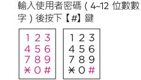

#### 0 電池 M) 電池蓋

• 使用説明書

· 安裝說明書

・ 施工園

組 成

- 鎖扣板
- 螺杆
- 雷光
- · 卡片
- 遙控器(另行購買)

2

· 在數位鍵盤指示燈熄滅之前 · 重複進行上述第3項操作 · 即可新增註冊其它使用者密碼。( 最多可註冊4個 ) . 使用者密碼不能與管理者 / 訪客密碼相同 <

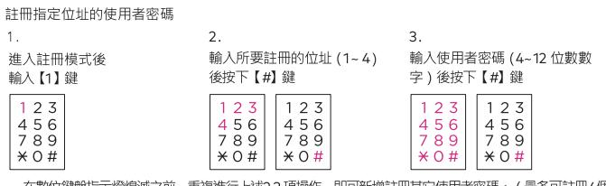

 在數位鍵盤指示燈熄滅之前·重複進行上述2-3 項操作·即可新增註冊其它使用者密碼。(最多可註冊4個) .使用者密碼不能與管理者 / 訪客密碼相同《

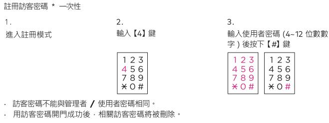

· 若未在 10 秒內輸入·驗證將被取消。

- ‧ 輸入管理者 / 使用者/訪客密碼的過程中‧若按下【\* 】鍵‧其輸入過程將被初始化‧
- 若未在輸入密碼的狀態下按下【#】鍵或在驗證過程中按【註冊】鍵‧驗證將被取消

6 0 #
17 0 %
4 % 0 % # -在數位鍵盤指示燈熄滅之前·重複進行第 3 項操作·即可新增註冊其它用戶卡片 ( 最多可註冊 100 個 )

CARD

123

· 用戶卡片不能與管理者卡片相同

・若未在 10 秒内輸入・驗證將被取消・

若未在輸入密碼的狀態下按下【#】鍵或在註冊過程中按【註冊】鍵·驗證將被取消。

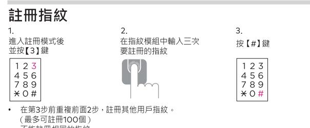

· 不能註冊相同的指紋

如果10秒鐘內沒有輸入‧註冊將被取消

如果在註冊過程中没有按【\*】鍵或按【註冊】鍵,註冊將被取消

### 進入刪除模式

| 用管理者密碼驗證 :                                 | 用管理者卡片驗證 :                     |
|--------------------------------------------|--------------------------------|
| 1. 按住【註冊】鍵 3 秒鐘 2. 輸入管理者密碼 3. 按下【#】鍵 | 1. 按住【註冊】鍵 3 秒鐘 2. 用管理者卡片接觸 |

若未在 10 秒内輸入・驗證將被取消

若輸入小於 6 位或 13 位數及以上的數位密碼·將發出錯誤提示音·驗證將被取消

輸入管理者密碼的過程中·若按下【\*】鍵·其輸入過程將被初始化。 若在未輸入密碼的狀態下按【#】鍵或在驗證過程中按【註冊】鍵‧驗證將被取消

### 密碼刪除方法 刪除單個使用者密碼 2. 輸入【1】鍵再輸入所要 進入刪除模式

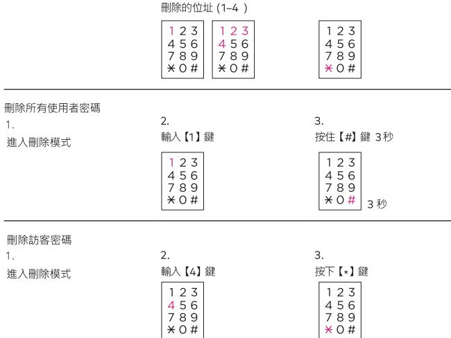

3.

按下【\*】鍵

### 卡片删除方法

### 删除單個管理者卡片(要刪除的管理者卡預設地址)

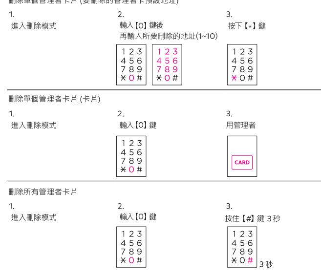

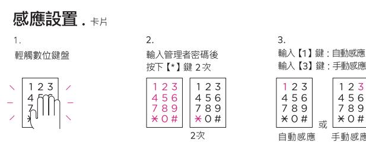

自動感應功能在出廠時預設設置為開啟狀態。

在手動威應模式下,請先輕觸數位鍵盤後,再將卡片接觸到卡片威應區即可開門

### 雙重驗證設置

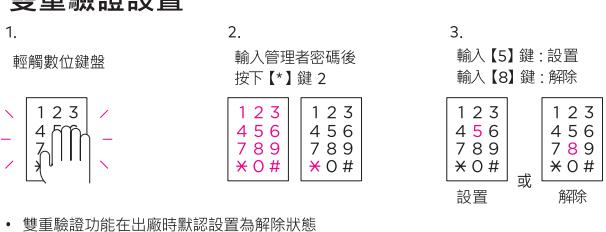

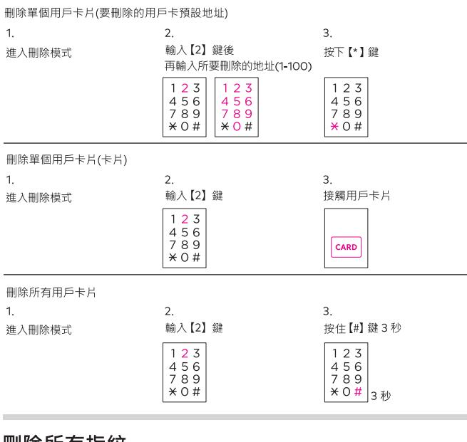

### 刪除所有指紋 1

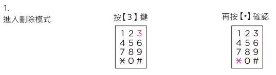

### 雙重認證下開門

1.

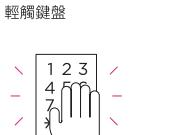

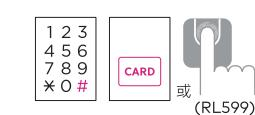

按【#】鍵讀取卡片或用戶指紋

3

• 訪客密碼不可用於雙重認證• (即使在雙重身份驗證設置的情況下也進行一般驗證) • 卡片如未註冊·則雙重驗證不適用·(即使在雙重驗證設置的情況下也進行一般驗證)

輸入管理者/用戶/訪客密碼

### • 如果10秒內沒有任何輸入• 則認證被取消

- ・ 如果您對暴露密碼感到焦慮‧請使用虛位密碼功能。(但如輸入超過21位數字‧包括密碼會產生 一個錯誤音,您將不得不再次輸入。)
- 如果密碼輸錯5次以上時·會發出1分鐘警報聲。1分鐘後恢復正常後,請再試一下。
- 用訪客密碼開門成功後•相關訪客密碼將被刪除 •
- 設定虚位密碼功能·在密碼前後輸入虛數(隨機數)·門將打開

2.

.56

789

× 0 #

### 在室外開門·卡片

將卡片接觸到威應區即可開門

• 在雙重驗證模式下·請先輸入密碼 在曼重繳證換式下「商先輸入出場」
在卡片手動驗證模式下「請先輕觸數字鍵盤後,再將卡片接觸到感應區

### 指紋用戶 (RL599)

當用註冊過的指紋按上指紋讀卡模組上時,鎖就會被打開

## 音量設置

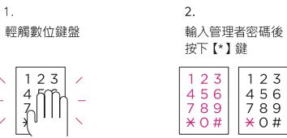

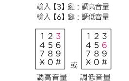

3

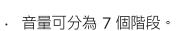

## 虚位密碼功能設置

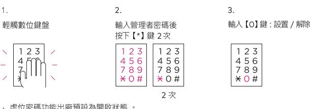

遙控器功前能設置 ·遙控器 / 接收器 均需另行購買 註冊滚控股

### 在室内開門

- 1.在門被鎖上的狀態下,按下內側鎖體的【OPEN】鍵即可開鎖
- 2. 在門被鎖上的狀態下·將內側鎖體的手動開關旋鈕向打開的方向旋轉即可開鎖

### 在室外鎖門

### 在自動上鎖模式下鎖門

· 關門後 2 秒左右 · 門會自動上鎖

### 在手動上鎖模式下鎖門(不使用【#】鍵)

在門被關上的狀態下輕觸數位鍵盤即可鎖門

### 在手動上鎖模式下鎖門(不使用【#】鍵

: 在門被關上的狀態下輕觸數位鍵盤後按下【 #】鍵即可鎖門

### 在室內鎖門

- 在自動上鎖模式下鎖門
	- · 關門後 2 秒左右 · 門會自動上鎖
	- 在手動上鎖模式下鎖門(不使用【#】鍵)
	- · 在門被關上的狀態下·按下內側鎖體的【OPEN 】鍵即可鎖門 . 在門被關上的狀態下‧將內側鎖體的手動開關旋鈕向關閉方向旋轉即可鎖門
	-

### 在內部反鎖(內部強制上鎖) · 禁止室外開

### 設置內部反鎖

在門被鎖上的狀態下按住【OPEN】鍵 3 秒鐘

### 在室內解除內部反鎖

·在門被鎖上的狀態下,按下內側鎖體的【OPEN】鍵即可開門並接觸內部反鎖 · 在門被鎖上的狀態下·將內側鎖體的手動開關旋鈕向打開方向旋轉即可解除內部反鎖

### 在外部反鎖(外部強制上鎖). 使內側鎖體【OPEN】鍵失效 設置外部反鎖

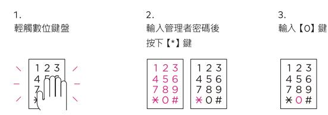

### 解除外部反鎖

用密碼、卡片、遙控器、手動開關旋鈕來開鎖即可解除外部反鎖設置

### 提示及警報功能

### 提示方舌卡住

開 / 關門時‧當室內鎖體的方舌不正常運行而被卡住時‧即會連續發出 3 次"嘀嘀嘀"的警報聲

· 若警報聲響不停且產品仍不正常運行·需要重新調整門鎖位置·此時請聯繫本公司的安裝工程師

### 提示更換電池

在正常運行後,到了需要更換電池之時會,產品會發出"隨嘀嘀"的警報聲

- 發出警報聲後‧若仍未更換電池而繼續使用‧很快就會停止運行‧故請務必及時更換電池
- 更換電池時·請更換所有電池。
- 更换地比例 请更换用户或使用完的電池混合使用 請勿將製造商互不相同的電池混合使用
- 

### 緊急外接電池的使用方法

- 1. 將緊急外接電池(9V)接觸到緊急外接電源介面
- 2. 輸入管理者 / 使用者密碼後按下 [ # ] 鍵
- 3. (在雙重驗證模式下)用管理者/用戶卡片威應認證。

. 因電池漏液而無法開門時,請購買市場銷售的緊急外接電池(9V)作為緊急接電使用

上鎖設置 / 千鼎トド

# 輸入【1】鍵:自動感應 輸入【3】鍵:手動感應 123 100914
 1000

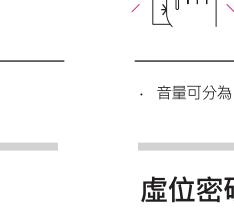

1.

| ------------------------------------------------------------------------------------------------------------------------------------------------------------------------------ |                                                                            |                                                                                 |
|--------------------------------------------------------------------------------------------------------------------------------------------------------------------------------|----------------------------------------------------------------------------|---------------------------------------------------------------------------------|
| 1.                                                                                                                                                                             | 2                                                                          | ന്                                                                              |
| 輕觸數位鍵盤                                                                                                                                                                         | 輸入管理者密碼後                                                                   | 輸入【4】鍵:自動上鎖                                                                     |
|                                                                                                                                                                                | 按下 (*) 鍵 2 次                                                               | 輸入【7】鍵:手動上鎖                                                                     |
| 1 2 3   1 4 mm 7 /                                                                                                                                                 | 1 2 3   123 4 5 6 4 5 6 7 8 9 7 8 9   * 0 #     * 0 # | 1 2 3 1 2 3 4 5 6   4 5 6 7 8 9   7 8 9 * 0 #   × 0 # 市 |
|                                                                                                                                                                                | 2 次                                                                        | 自動上鎖 手動上鎖                                                                    |
| 設置在手動上鎖模式下【#】鍵的停用 / 啟用                                                                                                                                                         |                                                                            |                                                                                 |

| 輕觸數位鍵盤 1 2 3 1 | 輸入管理者密碼後 按下【*】鍵 2 次 23   123 1                  | 輸入【8】鍵:停用【#】鍵 輸入【9】鍵:啟用【#】鍵 1 2 3   1 2 3                          |
|----------------------|-------------------------------------------------------------|-----------------------------------------------------------------------------|
| រូសា                 | 5 6 4 5 6 4 8 9 789 7 *0# * 0 # 2 次 | 4 5 6   5 6 র্ব 789 8 9 7 * 0 # * 0 # 同 停用 啟用 |

| Color College of Children Color 1. 進入註冊模式  | 2. 按下【OPEN】鍵                     | 3. 按下【#】键                           |  |  |
|--------------------------------------------------|-------------------------------------|----------------------------------------|--|--|
|                                                  | 0 搖控器                            | 123 4 5 6 7 8 9 * 0 #      |  |  |
| · 若在上述第3項操作前反覆進行第2項操作·即可添加註冊其他遙控器。 (最多可註冊至5個) |                                     |                                        |  |  |
| 删除搓控器                                            |                                     |                                        |  |  |
| 1.                                               | 2.                                  | ന്                                     |  |  |
| 進入刪除模式                                           | 輸入【5】鍵                              | 按下【*】 键                                |  |  |
|                                                  | 1 2 3 4 5 6 7 8 9 * 0 # | 1 2 3 ব 5 6 7 8 9 * 0 # |  |  |

• 註冊新的設備時·之前已被註冊的遙控器將被自動刪除

在門被鎖上的狀態下‧若感應到門被異常開啟會發出 80分貝以上的警報聲

· 取出電池或輸入密碼·或將卡片接觸到卡片感應區即可解除警報聲

#### 高溫威應警報

在高溫警報功能開啟下‧若感應到疑似火災的異常高溫(62°C± 5°C)‧即會發出強烈警報聲並自動 解除銷定狀態。

內側鎖體長時間暴露在直射陽光下也會發出警報聲

即使在內部反銷模式下也會自動解除鎖定狀態。

· 產品本身溫度高時警報聲將不會解除。

#### 防惡作劇警報

若連續 5-次輸入尚未註冊的密碼,或連續 5-次將尚未註冊的卡片接觸到卡片威應區,即會發 出警報聲·此後 1 分鐘無法進行驗證。

.1分鐘後,輸入己註冊的密碼或將已註冊的卡片接觸到卡片威應區,將使產品恢復正常使用

自動上鎖功能在出廠時預設設置為開啟狀態

最初設置手動上鎖時 ·【#】鍵處於停用狀態

設置自動上鎖模式時・關門後 2 秒左右・門會自動鎖上・

在手動上鎖模式下,即使關門後,門也不會自動鎖上。